# ALIDA_Manual - Copia

*Document Type: DOCX*

## **ALIDA**

Advanced Learning and Intelligent Data Analytics

*An Engineering Solution*

The ALIDA Team

[https://home.alidalab.it/](https://home.alidalab.it/)

info@alidalab.it

December 3, 2024

## **Abstract**

ALIDA is a microservice-based platform for composition, deployment, optimization, execution and monitoring of big data analytics workflow.

It is an ENG asset thought and developed in the light of the massive use of AI algorithms on diverse datasets. It simplifies all the four (4) phases of big data analytics, from the selection of the data set(s) to the selection of the algorithm to be applied on it. It allows the definition of processing workflows on multiple yet dispersed data sources.

## **Dedication**

## **Declaration**

## **Acknowledgements**

To those who remain in the heart of the ALIDA Team: Domenico Messina, ...

To those who still swim in this sea: Susanna Bonura, Delia Milazzo, Flavio Scaccia, Davide Profeta, Nicola Masi, Matteo Stanislao Giarrusso, Piero Di Liberto, Sergio Comella, Salvatore Cipolla, Rosario Catelli, ...

 

## Table of Contents
## **Contents**
  - [**ALIDA**](#alida)
  - [**Abstract**](#abstract)
  - [**Dedication**](#dedication)
  - [**Declaration**](#declaration)
  - [**Acknowledgements**](#acknowledgements)
  - [**Contents**](#contents)  
  - [**PART I**](#part-i)
  - [**1. ALIDA**](#1-alida)
  - [**1.1 What is it?**](#11-what-is-it)
  - [**1.2 What is it for??**](#12-what-is-it-for)
  - [**1.3 Why do you need it??**](#13-why-do-you-need-it)
  - [**1.4	How does it work?**](#14-how-does-it-work)
  - [**1.5	When can it be used?**](#15-when-can-it-be-used)
  - [**1.6  In a nutshell?**](#16-in-a-nutshell)

  - [**Contents**](#contents)

  - [**Type**](#type)
  - [**Start Date**](#start-date)
  - [**End Date**](#end-date)
  - [**ENG Grant Amount**](#eng-grant-amount)
  - [**PM**](#pm)
  - [**Partner Name**](#partner-name)
  - [**Acronym**](#acronym)
  - [**Country**](#country)
  - [**Type**](#type)
  - [**Start Date**](#start-date)
  - [**End Date**](#end-date)
  - [**ENG Grant Amount**](#eng-grant-amount)
  - [**PM**](#pm)
  - [**Partner Name**](#partner-name)
  - [**Acronym**](#acronym)
  - [**Country**](#country)
  - [**Type**](#type)
  - [**Start Date**](#start-date)
  - [**End Date**](#end-date)
  - [**ENG Grant Amount**](#eng-grant-amount)
  - [**PM**](#pm)
  - [**Partner Name**](#partner-name)
  - [**Acronym**](#acronym)
  - [**Country**](#country)
  - [**Type**](#type)
  - [**Start Date**](#start-date)
  - [**End Date**](#end-date)
  - [**ENG Grant Amount**](#eng-grant-amount)
  - [**PM**](#pm)
  - [**Partner Name**](#partner-name)
  - [**Acronym**](#acronym)
  - [**Country**](#country)
  - [**Data Governance Layer**](#data-governance-layer)
  - [**Scalable Big Data Management & Processing Layer**](#scalable-big-data-management--processing-layer)
  - [**Applications Layer**](#applications-layer)
  - [**Cyber Security - Data Privacy Layer**](#cyber-security---data-privacy-layer)
  - [**Type**](#type)
  - [**Start Date**](#start-date)
  - [**End Date**](#end-date)
  - [**ENG Grant Amount**](#eng-grant-amount)
  - [**PM**](#pm)
  - [**Partner Name**](#partner-name)
  - [**Acronym**](#acronym)
  - [**Country**](#country)
  - [**Type**](#type)
  - [**Start Date**](#start-date)
  - [**End Date**](#end-date)
  - [**ENG Grant Amount**](#eng-grant-amount)
  - [**PM**](#pm)
  - [**Partner Name**](#partner-name)
  - [**Acronym**](#acronym)
  - [**Country**](#country)
  - [**Type**](#type)
  - [**Start Date**](#start-date)
  - [**End Date**](#end-date)
  - [**ENG Grant Amount**](#eng-grant-amount)
  - [**PM**](#pm)
  - [**Partner Name**](#partner-name)
  - [**Acronym**](#acronym)
  - [**Country**](#country)
  - [**Services and Application**](#services-and-application)
  - [**Model Testing [PS4] we could call it as S2;**](#model-testing-ps4-we-could-call-it-as-s2)
  - [**Type**](#type)
  - [**Start Date**](#start-date)
  - [**End Date**](#end-date)
  - [**ENG Grant Amount**](#eng-grant-amount)
  - [**PM**](#pm)
  - [**Partner Name**](#partner-name)
  - [**Acronym**](#acronym)
  - [**Country**](#country)
  - [**Type**](#type)
  - [**Start Date**](#start-date)
  - [**End Date**](#end-date)
  - [**ENG Grant Amount**](#eng-grant-amount)
  - [**PM**](#pm)
  - [**Partner Name**](#partner-name)
  - [**Acronym**](#acronym)
  - [**Country**](#country)
  - [**Purpose:**](#purpose)
  - [**Types of Replication:**](#types-of-replication)
  - [**Challenges:**](#challenges)
  - [**Purpose:**](#purpose)
  - [**Approaches to Synchronization:**](#approaches-to-synchronization)
  - [**Techniques:**](#techniques)
  - [**Use Cases**](#use-cases)
  - [**Common Use Cases:**](#common-use-cases)
  - [**Comparison: Basic vs. Advanced ETL**](#comparison-basic-vs-advanced-etl)
  - [**Key Benefits**](#key-benefits)
  - [**Popular Platforms**](#popular-platforms)
  - [**Aspect**](#aspect)
  - [**Data Wrangling**](#data-wrangling)
  - [**Data Blending**](#data-blending)
  - [**Objective**](#objective)
  - [**Focus**](#focus)
  - [**Techniques used**](#techniques-used)
  - [**Data Augmentation in the different areas**](#data-augmentation-in-the-different-areas)
  - [**1️⃣ Computer Vision (Images)**](#1-computer-vision-images)
  - [**Changing brightness and contrast**](#changing-brightness-and-contrast)
  - [**2️⃣ Natural Language Processing (NLP)**](#2-natural-language-processing-nlp)
  - [**3️⃣ Tabular Data (Structured Data)**](#3-tabular-data-structured-data)
  - [**Benefits of Data Augmentation**](#benefits-of-data-augmentation)
  - [**Limitations and Challenges**](#limitations-and-challenges)
    - [**N.B. Bisogna capire se fare una sezione specifica per MLOps, oppure rispondere in maniera puntuale nelle sezioni ”Performance and Scalability”, ”Delivery” e ”Model Management” le cui innovazioni sono per Gartner il concetto di MLOps.**](#nb-bisogna-capire-se-fare-una-sezione-specifica-per-mlops-oppure-rispondere-in-maniera-puntuale-nelle-sezioni-performance-and-scalability-delivery-e-model-management-le-cui-innovazioni-sono-per-gartner-il-concetto-di-mlops)
  - [**Questo va nella famiglia ”Data Access” **](#questo-va-nella-famiglia-data-access-)
    - [**Se qui l’intenzione era descrivere la presenza del workflow builder grafico, quella descrizione andrebbe sotto la sezione ”Visual Pipelining or Visual Composition Framework”. Altre questioni, inerenti MLFLOW vanno piazzate altrove, cercando di capire di cosa si vuole parlare, quale feature si vuole descrivere.**](#se-qui-lintenzione-era-descrivere-la-presenza-del-workflow-builder-grafico-quella-descrizione-andrebbe-sotto-la-sezione-visual-pipelining-or-visual-composition-framework-altre-questioni-inerenti-mlflow-vanno-piazzate-altrove-cercando-di-capire-di-cosa-si-vuole-parlare-quale-feature-si-vuole-descrivere)
    - [**Anche queste sottosezioni andrebbero spostate, presumibilmente sotto quella di ”Delivery”.**](#anche-queste-sottosezioni-andrebbero-spostate-presumibilmente-sotto-quella-di-delivery)
  - [****](#)
    - [**Questa sottosezione va spostata perché non spiega all’utente come sfruttare Alida per fare qualcosa, bensì tratta teoria generica.**](#questa-sottosezione-va-spostata-perché-non-spiega-allutente-come-sfruttare-alida-per-fare-qualcosa-bensì-tratta-teoria-generica)
  - [****](#)
  - [**Appendix A**](#appendix-a)
  - [**Appendix B**](#appendix-b)

## **PART I**

Introduction
## **1. ALIDA**

This chapter introduces the ALIDA platform. In particular, there are two main sections: the first presents the software product in its overall view, explaining its raison d’être, while the second provides an overview of the use cases in which ALIDA finds application, although these cases are not exhaustive but rather constantly evolving and enriching.

## **1.1 What is it?**
ALIDA is a cutting-edge microservices-based platform meticulously designed and developed by Engineering Ingegneria Informatica.

It is a resource that is both fundamental and versatile: on the one hand it optimises, automates and industrialises Data Science and Machine Learning (DSML) processes, on the other hand it composes, distributes, optimises, executes and monitors Data Analytics workflows.

ALIDA is built to simplify the process of applying analytics and artificial intelligence algorithms to disparate data sets, enabling organisations to increase operational efficiency and agility, accelerating the transition from proof of concept to production.

## **1.2 What is it for??**
ALIDA has a pivotal role in facilitating the entire spectrum of big data analytics and serves as a versatile tool for designing, deploying, and operationalising their applications.

It allows users to seamlessly handle all phases of big data processing, from the initial selection of data sets to the choice of the most appropriate algorithms for analysis, enabling the creation of customised workflows even with real time data, selecting services and data from an extensive catalogue. In addition, it makes possible to manage schedules, outputs and errors related to different executions, enabling evaluations and validations capabilities.

Essentially, ALIDA serves as a comprehensive tool for data scientists and analysts to manage and optimise their big data analytics workflows: it is indispensable for rapidly prototyping AI and Big Data Analytics applications while supporting the operationalisation of Machine Learning (ML) models.

## **1.3 Why do you need it??**
In the current data science and machine learning landscape, the volume and complexity of data make traditional approaches inadequate. In turn, DSML platforms are rapidly evolving and organisations must adapt to stay competitive: ALIDA is your solution to meet the challenges of modern analytics.

With ALIDA, you can promptly address these evolving needs in data science, ML, and data analytics operationalisation because it simplifies and enhances your big data analytics endeavours. In addition, it addresses the need for agility, resilience, and operational efficiency in ML pipelines and production models: it empowers you to efficiently harness the potential of AI algorithms on diverse data sets, ensuring that your data-driven decisions are well-informed and accurate.

## **1.4 How does it work?**
ALIDA’s operation is based on a microservices architecture, providing modularity and scalability.

It allows users to define and process customised workflows on multiple but separate data sources by selecting big data analytics services from its catalogue: this means that you can orchestrate complex data analysis tasks by breaking them down into manageable components, optimising resource utilisation, and monitoring each step of the process. ALIDA’s integration with AI algorithms and data sets is seamless, making it easy to create, deploy, and optimise data analytics workflows.

Finally, ALIDA simplifies deployment within the target cluster using a package manager. It leverages the most cutting-edge technologies and frameworks, and its cloud-native design ensures scalability of computing and storage resources through a pipeline orchestration engine built on Kubernetes capabilities for cloud resource management.

## **1.5 When can it be used?**
ALIDA can be used whenever you engage in big data analytics projects. Its versatility and capabilities are an invaluable support for a wide range of scenarios, including but not limited to:

**Agile ML Pipelines**: for rapidly prototyping AI and Big Data Analytics applications.
**Business Intelligence**: to gain insights from large volumes of data for strategic decision-making.
**Cloud-Native Environments**: for scaling computing and storage resources as needed.
**Data Analytics**: in processing and analysing large volumes of data for actionable insights.
**Data Mining**: for extracting valuable patterns and knowledge from complex data sources.
**Data Transformation and Integration**: in data preprocessing and cleansing phases.
**Federated Learning**: ML technique for training algorithms via multiple independent sessions, addressing critical issues such as data privacy and security.
**Industrialised DSML**: to streamline and automate the transition from proof of concept to production.
**Model Evaluation and Comparison**: assessing the correctness of inferences, predictions and functionality of the resulting models.
**Model Serving**: to make the ML model accessible to multiple applications via API.
**Operationalisation of ML Models**: to support the deployment of ML models within target infrastructures.
**Predictive Analytics**: in forecasting trends, behaviour, or outcomes based on historical data.
**Research, Development and Innovation**: when exploring new data sets and AI algorithms to develop cutting-edge solutions to bring to market.

## **1.6 In a nutshell??**
In summary, ALIDA is your go-to corporate asset for modern data science and machine learning: it is a powerful resource that empowers organisations to embrace the industrialisation of DSML.

In addition, it provides automation capabilities, supports rapid prototyping and makes ML models operational, making them essential for the evolving landscape of data science, ML and data analysis operations.

Overall, it simplifies, streamlines, and empowers your big data analytics endeavours, ensuring you make data-driven decisions with confidence.
 
 
 

##  *****USE CASES*****   

## ****MobiSpaces****

Figure 2.1.1: MobiSpaces Project Logo

| ## **Type** | ## **Start Date** | ## **End Date** | ## **ENG Grant Amount** | ## **PM** |
| --- | --- | --- | --- | --- |
| ML-Ops | 1 Sept 2022 | 31 Aug 2025 | 412500,00 € | x |

*Table ********2.1.1****: MobiSpaces Project Info*

Partners
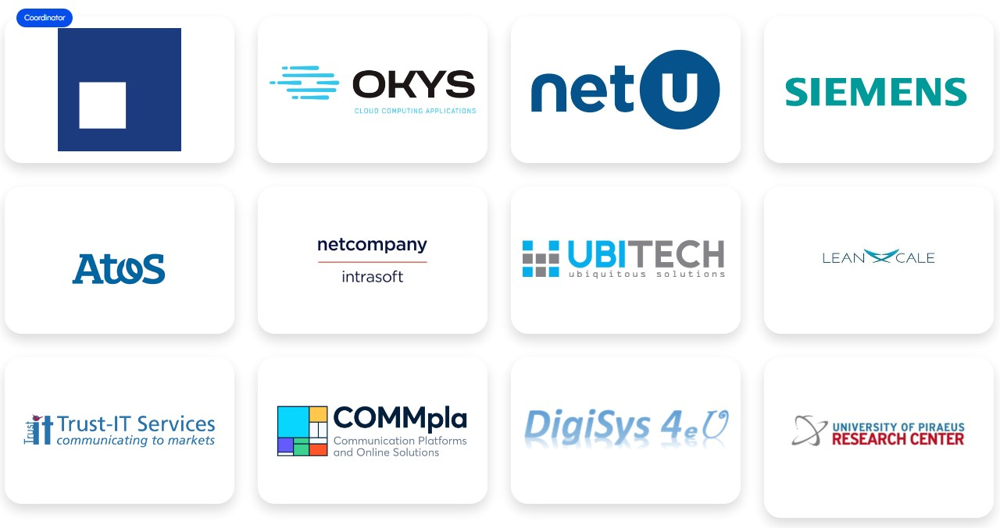
Figure 2.1.2: MobiSpaces Partners Logos 01

Overview
MobiSpaces is an end-to-end mobility-aware and mobility-optimized data governance platform based on mobility analytics for efficient, reliable, secure, fair and trustworthy data processing.

### ## **Partner Name**

**## **Acronym****: ## **Country**

### Engineering Ingegneria Informatica S.p.A.

**ENG**: Italy

### Atos Spain SA

**ATOS**: Spain

### Robert Bosch GMBH

**BOSCH**: Germany

### Siemens SRL

**SIEM**: Romania

### Frequentis AG

**FREQ**: Austria

### Azienda Mobilità e trasporti SpA

**AMT**: Italy

### Marintrafik Opereisons Monoprospi Anonymi Etairia Pliroforikis

**MOMA**: Greece

### Emisia SA-Anonymi Etairia Perivallontikon kai Energiakon Meleton kai Anaptixis Logismikou

**EMISIA**: Greece

### Emisia SA-Anonimi Erairia

**EMISIA**: Greece

### OKYS LTD

**OKYS**: Bulgaria

### Ubitech Limited

**UBIT**: Cyprus

### Leanxcale SL

**LEANX**: Spain

### Unparallel Innovation LDA

**UIL**: Portugal

### Trust-IT Services SRL

**TRUST**: Italy

### COMMPLA SRL

**COMMPLA**: Italy

### Geodatastyrelsen

**GEODATA**: Denmark

### Digital Systems 4.0

**DS4**: Bulgaria

### NET-U Consutlant LTD

**NET-U**: Cyprus

### Universal of Piraeus Research Center

**UPRC**: Greece

### Universite Libre de Bruxelles

**ULB**: Belgium

### Australian Institute of Technology GMBH

**AIT**: Australia

### Aalborg Univeristet

**AAUN**: Denmark

### White Label Consultancy APS

**WLC**: Denmark

### Fujitsu Service GMBH

**FSG**: Germany

### Fujitsu Technology Solutions GMBH

**FTSG**: Germany

*Table ********2.1.2****:** MobiSpaces Partners*

The purpose of the application is to address the problem of bus scheduling. Given a timetable (provided by the municipality of Genoa), it aims to assign a series of bus trips to a specific bus, optimizing battery usage, depot charging times, and overall fleet deployment.

Subsequently, it seeks to transform the maintenance process, currently performed traditionally, into a modern process with an approach based on automatic data learning.

Finally, it aims to measure the degradation of bus battery performance over time, predict their useful life, and anticipate details regarding their maintenance.

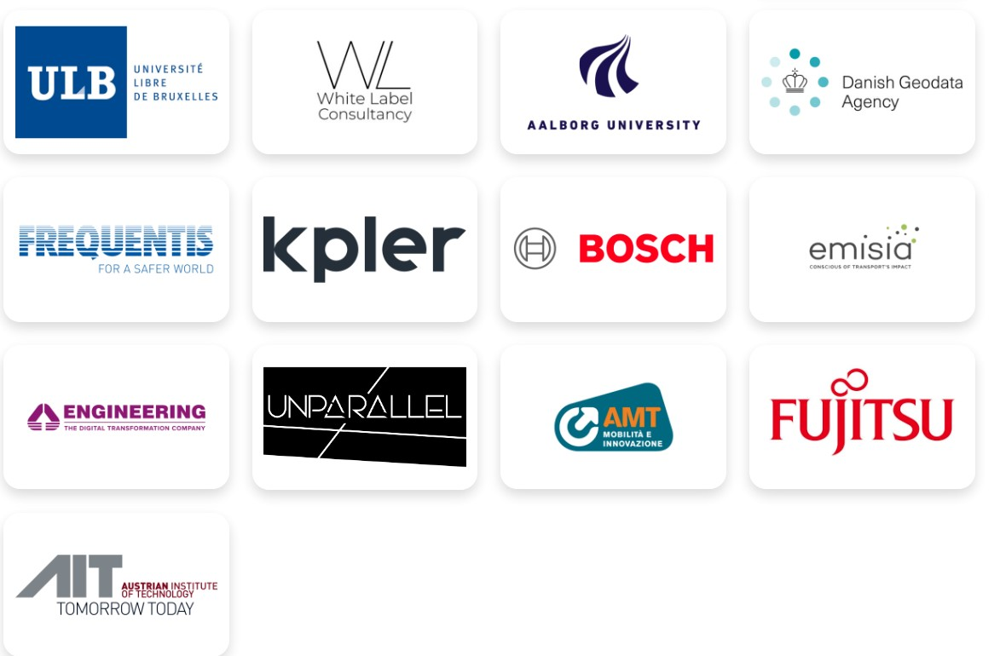
Figure 2.1.3: MobiSpaces Partners Logos 02

Zooming into project
MobiSpaces aims to address the complex challenges of managing mobility data by providing a trustworthy and privacy-preserving platform that optimizes data processing for various applications such as intelligent transportation and vessel tracking. Through decentralized processing and validation across multiple use cases, MobiSpaces aims to establish a standard for reliable and sustainable data analytics, fostering growth in the EU digital economy.

Alida in the project
From the management point of view, this work was divided in five different tasks, one for each use case: Task 6.2 (iRoute – Intelligent Public Transport Routing), Task 6.3 (SmartSense – Intelligent Infrastructure Traffic Sensing), Task 6.4 (MT

Tracker – Edge-powered Vessel Tracking), Task 6.5 VesselEdge (Edge Computing Onboard of Moving Vessel) and Task 6.6 (CrowdSeaMapping– Federated Learning for Enhancing Nautical Charts).

In particular, for iRoute, use case deals with data governance, management and analysis for public transport applications, especially in electric buses field AMT, public transport company in the city of Genova, Italy and leader of iRoute use case, has identified two real scenarios to exploit the research of MobiSpaces, applying it to challenging situations of public transport management, that can be optimized thanks to a right usage of the big amount of data collected everyday by AMT.

The scenarios allow to take advantage of the MobiSpaces outcomes and exploit the mobility-aware data governance framework to drive strategic decisions based on the outcomes of the analytics.

The use case is set in the electric-vehicle environment that is growing in AMT: the e-bus fleet includes more than 100 buses, with the related operational and managerial issues given by the complexity of the electric system, from bus recharging to battery decay.

The first scenario is about predictive maintenance of electric buses and aims to anticipate possible faults, thanks to the machine learning techniques studied in the project. The second scenario deals with battery level management and aims to give an instrument to re-build bus schedules, both real-time and long-term, given predictions on battery duration based on the data analysed and on the expected battery decay.

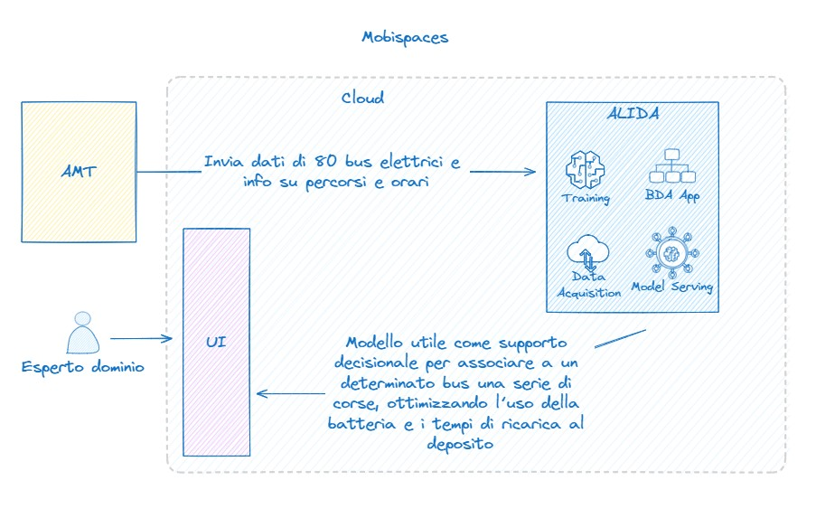
Figure 2.1.4:  MobiSpaces Contribution 01

Together with the already quoted machine learning techniques, many MobiSpaces components are working for use case 1, as explained in detail in the paragraphs below. The starting datasets are mostly internal to AMT, and are:

AVM (Automatic Vehicle Monitoring) data, that show real-time the positioning of each bus of the fleet and afterwards the trajectory travelled by the bus.
GTFS data, that contain the planned transit service in an open de-facto standard used by Public Transport Operators.
CanBus data, that collect information about the status of many bus systems including battery level, using FMS standard.
These internal data will be interlinked with external data, relevant for battery level, such as weather data or the elevation and the gradient of the path.

The internal data are usually located and stored on internal servers. A mission of the use case, detailed later in the deliverable, is to create a good, efficient and sustainable data path for the datasets described.

CyberSEAS

Figure 2.2.1: CyberSEAS Project Logo

| ## **Type** | ## **Start Date** | ## **End Date** | ## **ENG Grant Amount** | ## **PM** |
| --- | --- | --- | --- | --- |
| FML | 1 Octo 2021 | 30 Sept 2024 | €722264,38 | x |

*Table ********2.1.4****: CyberSEAS Project Info*

Partners

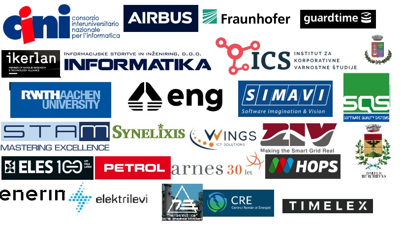
*Figure ********2.2****.********2****:  CyberSEAS Partners Logo*

**

### ## **Partner Name**

**## **Acronym****: ## **Country**

### Engineering Ingegneria Informatica S.p.A.

**ENG**: Italy

### Consorzio Interuniversitario Nazionale per l’Informatica

**CINI**: Italy

### Airbus Potect GMBH

**AIRP**: Germany

### Fraunhofer Gesellschaft zur Fonderung der Angewandten Forschung EV

**FGFR**: Germany

### Guardtime

**GT**: Estonia

### Ikerlan S. COOP

**IKS**: Spain

### Informatika Informacijske Storitve in Inzeniring DD

**IIS**: Slovenia

### Rheinisch-Westfaelische Technische Hochschule Aachen

**RWTG**: Germany

### Software Imagination &Vision SRL

**SIV**: Romania

### Software Quality System SA

**SQS**: Spain

### STAM SRL

**STAM**: Italy

### Synelixis Lyseis Pliroforikis

**SLPA**: Greece

### Automatismou & Tilepikoinonion Anonimi Etairia

**ATAE**: Greece

### Wing ict Solutions Technologies Pliroforikis kai Epikoinonion Anonimi Etaireia

**WSTP**: Greece

### Ziv Aplicaciones y Tecnologia SL

**ZAT**: Spain

### Comune di Berchidda

**CDBE**: Italy

### Comune di Benetutti

**CDBT**: Italy

### Eles doo Operater Kombiniranega Prenosneg in Distribucijskega Elektroenergetskega Omrezja

**EOKP**: Slovenia

### Petrol Slovenska Energetska Druzba dd Ljubljana

**PSED**: Slovenia

### Akademska in Raziskovalns Mreza Slovenije

**ARMS**: Slovenia

### Hrvatski Operator Prijenosnog Sustava D.D.

**HOPS**: Croatia

### Enerim OY

**ENER**: Finland

### Elektrilevi OU

**ELL**: Estonia

### Compania Nationala de Trasport al Energiei Electrice Transelectrica SA

**CNTE**: Romania

### Centrul Roman al Energiei

**CRE**: Romania

### Timelex

**TML**: Belgium

### Operato DOO

**OPER**: Slovenia

*Table ********2.2.1****: CyberSEAS Partners*

Overview
The benefits of using *Federated Machine Learning (FML) *include the ability to train models on distributed data without having to centralize them, ensuring data privacy and reducing the risk of transmitting sensitive information.

Within the CyberSEAS project we worked on a use case in the field of *Social Engineering Detection*, in particular in training intelligent models to detect fraudulent emails from the analysis of its text.

The FML therefore allowed us to create a *text classification *model for emails in a collaborative and secure way, without compromising the confidentiality of the personal data contained in the emails themselves.

Zooming into Project
The move towards more agile, connected, intelligent and data-driven energy systems, and their interconnection with our day-to-day lives, means that there is a major increase in cyber exposure of energy systems leading to major safety and privacy incidents.

The EU-funded CyberSEAS project improves the resilience of energy supply chains by protecting them from disruptions generated by complex attack scenarios.

CyberSEAS delivers an open and extendable ecosystem of 30 customisable security solutions providing effective support for key activities, such as risk assessment; interaction with end devices; secure development and deployment; real-time security monitoring; skills improvement and awareness; and certification, governance and cooperation. CyberSEAS solutions will be validated through experimental campaigns consisting of numerous attack scenarios.

Alida in the Project
The adopted solution in CyberSEAS is the synergistic use of ALIDA tool, in pair with SED (Social Engineering Detection).

ALIDA (Advanced Learning and Integration for Data Analysis) is a platform designed for federated machine learning and big data analytics. It facilitates secure, scalable, and privacy-preserving machine learning across distributed datasets. The platform supports various machine learning frameworks and provides tools for developing, registering, and managing BDA services.

SED (Social Engineering Detection): The SED tool focuses on detecting social engineering and phishing attempts through comprehensive analysis of email headers, body content, and attachments.

Most existing FML-enabled platforms support only a few open-source frameworks/libraries available to support the development/integration of FML-based algorithms. On the other hand, the solution integrated within the ALIDA asset wants to be able to support as many existing libraries and frameworks as possible, and in such a way as to be able to perform its own federation tasks quickly, thanks also to the support of a cloud-side graphical interface, and by exploiting/re-utilizing the algorithms made and already available within the ALIDA catalogue.

ALIDA leverages FLOWER (Federated Learning Over Wireless Networks) [4] federated learning framework because of its flexibility, customizability, interoperability, and easiness of use. Its design integrates workflows independent of the ML/DL framework (PyTorch, TensorFlow, etc.) with minimum performance overhead. It supports a wide range of machine learning algorithms, including deep learning, reinforcement learning and classical machine learning. It also includes model aggregation and fault tolerance, which are critical components of any federated learning system. Flower allows building scalable federated learning systems that can be deployed on a range of devices, including mobile phones, edge devices, and cloud servers.

The CyberSEAS federated and self-sovereign data analytics infrastructure has been built starting from the ALIDA platform, one of the tools made available in the CyberSEAS toolset. ALIDA (https://home.alidalab.it/) is a Data Science (DS) and ML platform based on advanced frameworks and open-source technologies for design, deployment, execution and monitoring of both stream and batch Big Data Analytics (BDA) workflows.

ALIDA is cloud-native, so it is able to scale computing and storage resources thanks to a pipeline orchestration engine that leverages the capabilities of Kubernetes for cloud resource management. ALIDA provides an extensible catalogue of BDA services (the building blocks of the BDA Application) which covers all phases, from ingestion to preparation, to ML analysis and for data publishing.

The reference framework used to enable FML between multiple client nodes and an aggregator node is Flower, a unified approach to federated learning, analytics, and evaluation. As shown in the next *Figure **2.2**.**3**: FML Architecture Flow in ALIDA platform*, ALIDA allows federated model training, so that users can train models without the need to expose data.

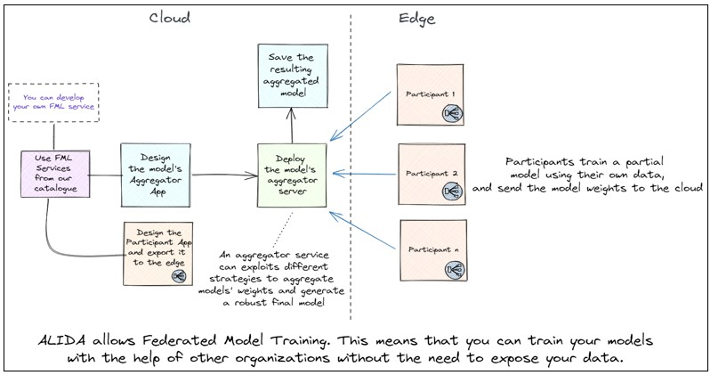
*Figure ********2.2****.********3****: **FML Architecture Flow in ALIDA platform*

Among the few open-source technologies that enable FML, Flower has been chosen for the following features:

Scalability: it was built to enable real-world systems with many clients
ML Framework Agnostic: it’s compatible with most existing and future machine learning frameworks such as PyTorch, Keras, SK-Learn
Cloud, Mobile, Edge & Beyond: it enables research on all kinds of servers and devices, including mobile
Research to Production: it enables ideas to start as research projects and then gradually move towards production deployment with low engineering effort and proven infrastructure
Platform Independent: it’s interoperable with different operating systems and hardware platforms to work well in heterogeneous edge device environments
Usability: it’s easy to get started with code examples for different frameworks.
Starting from the Flower framework, templates have been created for a new pair of BDA services areas for ALIDA platform: FML Aggregator and FML Participant areas, thus based on specific modules for the micro-service to be ALIDA compliant, being able to integrate and use at the same time all the features provided by Flower.

CiTrace
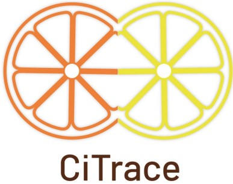
*Figure ********2.3****.********1****: CiTrace Project Logo*

| ## **Type** | ## **Start Date** | ## **End Date** | ## **ENG Grant Amount** | ## **PM** |
| --- | --- | --- | --- | --- |
| FML | 1 June 2021 | 1 May 2024 | n.a. | n.a. |

*Table ********2.3****.********1****: CiTrace **Project Info*

Partners

*Figure ********2.3****.********2****: CiTrace Partners Logo*

### ## **Partner Name**

**## **Acronym****: ## **Country**

### Engineering Ingegneria Informatica S.p.A.

**ENG**: Italy

### EHT

**EHT**: Italy

### Oranfresh

**ORF**: Italy

*Table ********2.3****.********2****: CiTrace Partners*

Overview
The CiTrace project proposes a reinterpretation of the concept of traceability in the Agrifood sector, offering a data-centric solution that views the product as an Information Vector along the entire production chain, from the field to the final consumer.

This Information Vector progressively enriches its informational content by leveraging all available information sources continuously. Applied to the citrus supply chain, the CiTrace solution acts as a concentrator of harmonized information, on which a set of Value-Added Services and specific tools can be built for the different phases of the supply chain, benefiting all involved stakeholders.

Zooming into Project
In the context of an agri-food project, Alida will be used to provide:

The Flexible and Optimal Pricing Strategy service is calculated considering three main indicators: production cost, selling price, and brand reputation. Once all necessary information and values are obtained, the result of executing the pipeline is a dataset that indicates the optimal and flexible pricing strategy.

Evaluating the shelf life of products along the supply chain through mathematical models and Machine Learning algorithms, aiming to obtain a trained model representing the added value of Dynamic Shelf-Life Assessment.

In defining the optimal distribution strategy, a fundamental role is played by analyzing data collected along the entire supply chain. This service is obtained by calculating and combining three indices: market penetration rate, inventory turnover, and order fulfilment. The Optimal Distribution Strategy model will be the result of training a Machine Learning algorithm based on these data.

BD4NRG

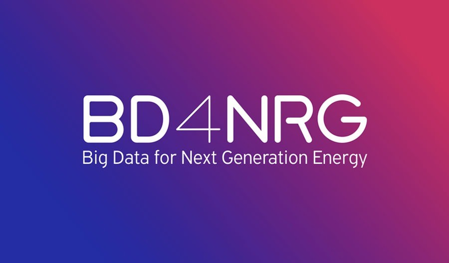
*Figure ********2.4****.********1****: BD4NRG Project Logo*

| ## **Type** | ## **Start Date** | ## **End Date** | ## **ENG Grant Amount** | ## **PM** |
| --- | --- | --- | --- | --- |
| ML-OPS | 1 Janu 2021 | 1 Dece 2023 | € 833 000,00 | n.a. |

*Table ********2.4****.********3****: BD4NRG Project Info*

Partners
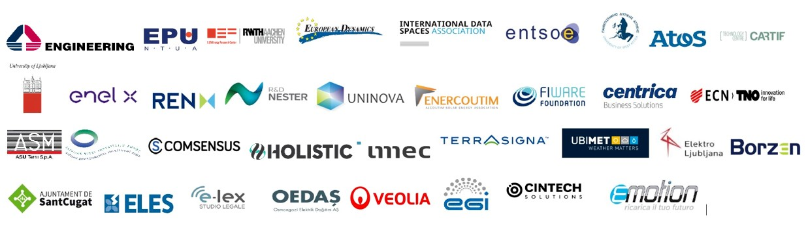
*Figure ********2.4****.********2****: BD4NRG Partners Logos*

### ## **Partner Name**

**## **Acronym****: ## **Country**

### Engineering Ingegneria Informatica S.p.A.

**ENG**: Italy

### Ethnicon Metsovion Polytechnion

### Rheinisch-Westfaelische Technische Hochschule Aachen

**RWTHA**: Greece

### European Dynamics Luxembourg SA

**EDL**: Luxemburg

### International Data Spaces EV

**IDS**: Germany

### European Network of Transmission System Operators for Electricity Aisbl

**ENTSO**: Belgium

### Panepistimio Dytikis Attikis

**PDA**: Greece

### Atos Ppain SA

**ATOS**: Spain

### Fundacion Cartif

**FC**: Spain

### Univerza v Ljubljani

**UNIL**: Slovenia

### Enel x srl

**ENEL**: Italy

### Rede Electrica Nacional SA

**REN**: Portugal

### Centro de Investigacao em Energia Ren - State Grid SA

**CIER**: Portugal

### Uninova-Instituto de Desenvolvimento de Novas Tecnologias-Associacao

**UNINOVA**: Portugal

### Enercoutim - Associacao Empresarialde Energia Solar de Alcoutim

**ENERC**: Portugal

### Fiware Foundation EV

**FIWARE**: Germany

### Centrica Business Solution Belgium

**CBSB**: Belgium

### Nederlandse Organisatie voor Toegepast Natuurwetenschappelijk Onderzoek TNO

**NORNO**: Netherlands

### Asm Terni SPA

**ASM**: Italy

### Vides Investiciju Fonds SIA

**VIF**: Latvia

### Comsensus, Komunikacije in Senzorika DOO

**COMS**: Slovenia

### Holistic Ike

**HI**: Greece

### Interuniversitair Micro-Electrinica Centrum

**IMEC**: Belgium

### Terrasigna SRL

**TER**: Romania

### UBIMET GMBH

**UBIMET**: Austria

### Elektro Ljubljana Podjetje Zadistribucijo Elektricne Enerije D.D.

**ELPZ**: Slovenia

### Borzen, Operater Trga z Elektriko, D.O.O.

**BORZ**: Slovenia

### Ajuantamiento de Sant Cugat del Valles

**ASCV**: Spain

### Eles doo Operater Kombiniranega Prenosnega in Distribucijskega Elektroenergetskega Omrezja

**EOKP**: Slovenia

### E-LEX - Studio Legale

**ELEX**: Italy

### Osmangazi Elektrik Dagitim Anonim Sirketi

**OED**: Türkiye

### Veolia Servicios Lecam Sociedad Anonima Unipersonal

**VSLSAU**: Spain

### Stichting Egi

**SEGI**: Netherlands

### Cintech Solution LTD

**CSL**: Cyprus

### Emotion SRL

**EMO**: Italy

*Table ********2.4****.********4****: BD4NRG Partners*

Case Overview
BD4NRG envisions to confront big data management challenges for the energy sector, giving a competitive edge to the European stakeholders to improve decision making and at the same time to open new market opportunities.

Zooming into Project
BD4NRG aims to enable an incremental decentralized energy data-driven ecosystem and a collaborative data sovereignty driven ecosystem. The goal is to unlock and exploit the economic potential of big data and give to Energy Sector stakeholders, the opportunity to improve their business operational performance.

To achieve this and to address the emerging challenges in big data management, BD4NRG partners will develop, adapt, deliver and deploy a distributed big data energy analytics framework - BD4NRG Framework, consisting of:

Several distributed intelligent collaborative federated nodes, the BD4NRGData Hubs
A graphically enriched Open Modular Big Data Analytics Energy Toolbox
A scalable big-data energy analytics environment
BD4NRG will combine DLTs/blockchain technologies with edge processing, Federated Machine Learning and Artificial Intelligence, to operate the data-driven energy ecosystem. Also, the project will make extensive adoption of open sources technology components and tools and Open APIs.

The BD4NRG Framework will include 4 horizontal and 1 vertical (cyber security) layer:

## **Data Governance Layer**

A necessary middleware to act as a mediator between data users and data providers who may want to decide case by case whether to disclose their data or not. State of the art solutions to guarantee traceability, provenance tracking and accountability but guaranteeing confidentiality as well.

## **Scalable Big Data Management & Processing Layer**

Smart management and processing of data by an intelligent information broker. The content of multiple data sources, being generated, managed and stored in the data management systems and the data hubs of the different operators and actors by innovative components and technology enablers.

## **Applications Layer**

Analytics-centred applications tailoring power network improved cross-functional decision-making to improve power network reliability, optimize management of flexibility assets, address building-scale energy efficient comfort management and dynamic situated renewable investment risk assessment.

Open Modular Smart Grid Big Data Analytics Toolbox: User-friendly with modern vision of the data analytics Toolbox, providing a working space for self-service capabilities that give autonomy to the end-user combining data that come from different sources.
Data / Models / Resources Marketplace: A virtual workbench with a variety of assets, including data, third party services, machine learning models, computing resources and storage resources as tradable assets providing off the shelf tools, library of reusable AI-based machine learning models, external off-domain data sets and reusable data-driven analytics applications.
## **Cyber Security - Data Privacy Layer**

A vertical layer to establish user authentication and authorisation to secure the non-open data of the transaction as well as to comply with the EC regulation on Data Protection

Alida in the Project
BD4NRG aims to develop data analytics services capable to analyse data in a seamless and holistic fashion, across multiple data sources. Among the existing efforts analysed, ALIDA BDA platform has been selected as a starting point for the BD4NRG Analytics Toolbox and it will be extended and validated in the energy domain, according to the needs that emerged in the requirements elicitation phase of the project. ALIDA embraces the paradigm of BDA-as-a-service (BDAaaS). Besides relevant cost savings, the provision of Big Data analytical capabilities using the cloud delivery model could ease the adoption of the toolbox and could simplify useful insights with different kinds of competitive advantage. BDAaaS consists of as a set of automatic tools and methodologies that allows users lacking Big Data expertise to manage BDA and deploy big data pipeline applications ready-to-be-executed addressing their goals at edge/fog/cloud nodes.

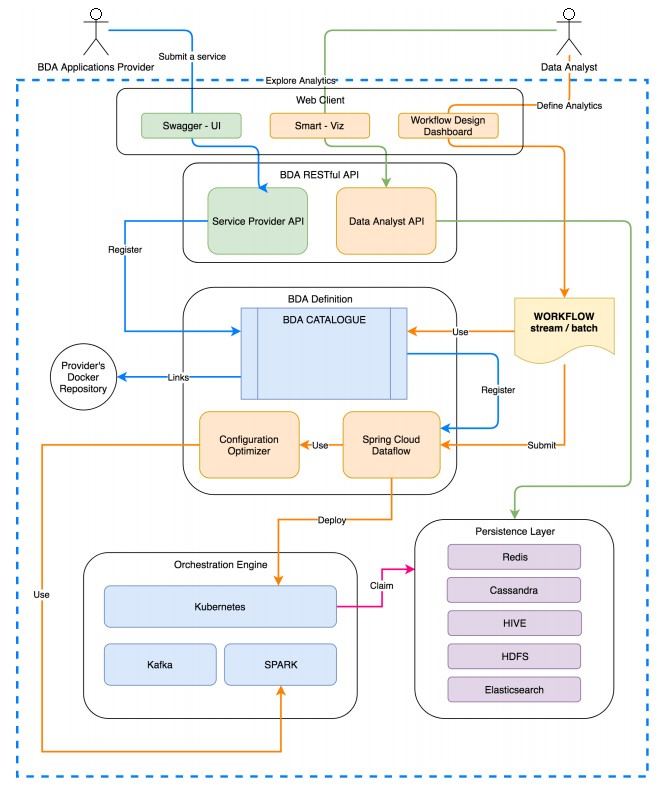
Figure 2.4.3

The ALIDA platform supports full orchestration of BDA application workflows and allows for composition, deployment and execution of workflows (either batch or stream) of BDA applications. *Figure** **2.4.3* describes the ALIDA general architecture.

SCREAM
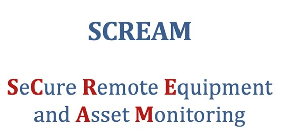
*Figure ********2.5****.********1****: SCREAM Project Logo*

| ## **Type** | ## **Start Date** | ## **End Date** | ## **ENG Grant Amount** | ## **PM** |
| --- | --- | --- | --- | --- |
| CLOUD-EDGE | 1 July 2020 | 30 June 2023 | n.a. | n.a. |

*Table ********2.5****.********5****: SCREAM Project Info*

Partners

*Figure ********2.5****.********2****: SCREAM Partners Logo*

### ## **Partner Name**

**## **Acronym****: ## **Country**

### Engineering Ingegneria Informatica S.p.A.

**ENG**: Italy

### Eka Srl

**EKA**: Italy

### IPREL Progetti Srl

**IPREL**: Italy

*Table ********2.5****.********6****: SCREAM Partners*

Case Overview
The SCREAM project proposes to study, define, design and implement an integrated, modular, flexible and adaptable platform for building dedicated solutions for the remote and optimised monitoring, maintenance and management of machines (Monitoring and Control - M&C) and production equipment (e.g. to predict equipment failures and determine solutions before they occur).

The platform will allow machine problems to be diagnosed (or predicted) and resolved via secure remote access, without the need for an on-site visit.

An open-source GUI for data visualization and exploration was made available on the cloud to consult both the stored historical data and the predictions obtained from the ML models trained on the consumption of the cutting blade and number of cuts; other ML/DL models for predictive maintenance and decision support were exported and used within applications run on the Sofidel company’s own machines, applied to real-time data.

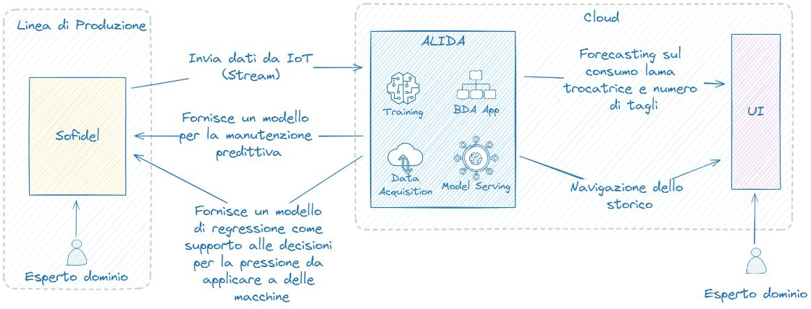
*Figure ********2.5****.********3****: SCREAM Contribution 01*

Zooming into Project
The solutions proposed in the project will be based on Big Data and Artificial Intelligence and will consider the specific characteristics, peculiarities, needs and requirements of the production environment and the organisations using the production equipment and machines. Furthermore, special attention will be given to the specific business relationship that exists between the manufacturer/supplier and the various users (goods producing industries).

Engineering is the Project Coordinator and is responsible for all activities linked to the definition of the SCREAM Framework. Engineering is also working on Big Data Infrastructure for remote and secure “M&C” systems, aiming to define the infrastructure for Industrial Big Data Analytics based on a hybrid edge-cloud model and a complete toolkit of algorithms and analysis techniques to support machine analyses. Moreover Engineering takes care of the design of application services for the remote “M&C” systems of production machinery, with the aim of offering advanced services to support decision making.

Alida in the Project
In the example, the company Sofidel (producer of paper for hygienic and domestic use) sends IoT data in streaming to ALIDA through an asynchronous MQTT messaging protocol. This data includes information from machinery (embosser, rewinder, cutter blade, unwinder) for paper production.

In ALIDA, both **BDA App **streaming for the *data acquisition *and *data preparation,** *and *batch** *for pre-process and generate ML/DL models based on data stored within distributed data storage.

Infinitech

*Figure ********2.6****.********1****: Infinitech Project Logo*

| ## **Type** | ## **Start Date** | ## **End Date** | ## **ENG Grant Amount** | ## **PM** |
| --- | --- | --- | --- | --- |
| ML-OPS | 1 Octo 2019 | 31 Marc 2023 | n.a. | n.a. |

*Table ********2.6****.********7****: Infinitech Project Info*

Partners

*Figure ********2.6****.********2****: Infinitech Partners Logo 01*

### ## **Partner Name**

**## **Acronym****: ## **Country**

### Engineering - Ingegneria Informatica Spa

**ENG**: Italy

### Atos Spain Sa

**ATOS**: Spain

### Ibm Israel - Science And Technology Ltd

**IBM**: Israel

### Fujitsu Technology Solution

**FUJITSU**: France

### Hewlett Packard Italiana Srl

**HP**: Italy

### Singularlogic Anonymi Etaireia Pliroforiakon Systimaton Kai Efarmogonpliroforikis

**SAEP**: Greece

### Innovation Sprint

**IS**: Belgium

### Santander Uk Plc

**SAN**: United Kindom

### Sia Spa

**SIA**: Italy

### Unicaja Banco Sa

**UB**: Spain

### National Bank Of Greece Sa

**NBG**: Greece

### Aktif Yatirim Bankasi As

**AYB**: Türkiye

### Banka Slovenije

**BS**: Slovenia

### Banking & Payments Federation Ireland  Company Limited By Guarantee

**BPFI**: Ireland

### Dynamis Ae Genikon Asfaleion

**DAGA**: Greece

### Genillard & Co Gmbh

**GEN**: Germany

### Jrc Capital Management Consultancy & Research Gmbh

**JRC**: Germany

### Prive Services Europe Gmbh

**PSE**: Austria

### Crowdpolicy Psifiakes Symmetoxikesypiresies

**CPSI**: Greece

### Poste Italiane - Spa

**PI**: Italy

### Wenalyze

**WEN**: Spain

### Paris Europlace

**PE**: France

### Copenhagen Fintech

**CF**: Denmark

### Reportbrain Limited

**RL**: United Kingdom

### Leanxcale Sl

**LEAN**: Spain

### Gioumpitek Meleti Schediasmos Ylopoiisi Kai Polisi Ergon Pliroforikis Etaireia Periorismenis Efthynis

**GMSY**: Greece

### Innov-Acts Limited

**IAL**: Cyprus

### Unparallel Innovation Lda

**UI**: Portugal

### Roessingh Research And Development Bv

**RRAD**: Netherlands

### Etam Anonymh Etaireia Symboyleytikon Kai Melethtikon Ypireseion

**EAES**: Greece

### Fondazione Bruno Kessler

**FBK**: Italy

### University Of Galway

**UG**: Ireland

### Uninova-Instituto De Desenvolvimento De Novas Tecnologias-Associacao

**UID**: Portugal

### Bogazici Universitesi

**BU**: Türkiye

### Institut Jozef Stefan

**IJS**: Slovenia

### Edex - Educational Excellence Corporation ltd

**EDEX**: Cyprus

### University Of Glasgow

**UG**: United Kingdom

### Association O.R.T

**ORT**: France

### Fundacion Para La Promocion De La Innovacion Investigacion Y Desarrollo Tecnologico En La Industria De Automocion De Galicia

**FPLAPDLI**: Spain

### Fundacion Centro Tecnoloxico De Telecomunicacions De Galicia

**FCT**: Spain

### Dwf Germany Rechtsanwaltsgesellschaft Mbh

**DWF**: Germany

### Abi Lab-Centro Di Ricerca E Innovazione Per La Banca

**ABILAB**: Italy

### Bank Of Cyprus Public Company Ltd

**BCP**: Cyprus

### Caixabank Sa

**CAIXA**: Spain

### Agricultural Applications Ike

**AAI**: Greece

### University Of Piraeus Research Center

**UPRC**: Greece

### Assentian Europe Limited

**AEL**: Ireland

### Clear Communication Associates Ltd

**CCAL**: United Kingdom

### Inneurope Initiative S.L.

**IISL**: Spain

### The Governor And Company Of The Bank Of Ireland

**BOI**: Ireland

### Traffikanalysis Hub Limited

**THL**: United Kingdom

### Nexi Payments Spa

**NEXI**: Italy

*Table ********2.6****.********8****: **Infinitech Partners 01*

Case Overview
Poste Italiane sends data related to banking transactions to ALIDA, which, through the BDA App, trains a model for outlier classification.

This model is then deployed and used on a graphical user interface (UI) to provide a probability (to a domain expert) that new transactions were fraudulent.

The same interface is also utilized to gather feedback from the domain expert, which is useful for enriching the labelling of data, thus making the model increasingly performing with each training iteration. See *Figure **2.6**.**3**: Infinitech Contributions 01*

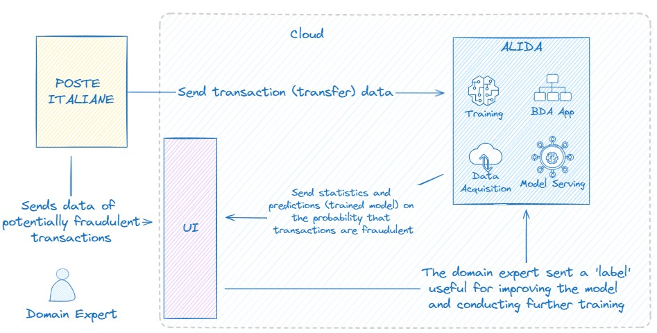
*Figure ********2.6****.********3****: Infinitech Contributions 01*

Zooming into Project
Emerging technologies such as big data, artificial intelligence (AI) and the internet of things (IoT) all have the potential to revolutionise how we live, work and play. But tapping into that potential first requires knowing how to use them – something that for the financial and insurance industry can be easier said than done.

“Many financial and insurance institutions still face difficulties using big data technology due to complicated regulations and a lack of appropriate test bed resources,” says Maurizio Ferraris, innovation manager at GFT Italia.

With the support of the EU-funded INFINITECH project, GFT, together with a consortium of over 40 fintech partners, are working to lower the barriers to datadriven innovation, boost regulatory compliance and stimulate investment.

In a nutshell, ALIDA is a Micro-service based platform for composition, deployment, optimisation, execution and monitoring of pipelines of Big Data Analytics (BDA) services. ALIDA is a result of previous research activities developed by ENG. Currently, it is a work in progress. ALIDA offers a catalogue of BDA services (ingestion, preparation, analysis, visualization): user designs his own (stream/batch) pipeline by choosing the BDA services from it, indicates which Big Data set he wants to process, launches and monitors the execution of the pipeline and personalizes the results visualization by choosing from a set of available graphs, all this without worrying about having software developer skills or particular knowledge on big data technologies. This service is registered in ALIDA catalogue as Spring Boot Application containing the python code and its dependencies. After implementing the algorithm using Pyspark, creating the Dockerfile and pushing the new image inside a repository, this microservice is registered into the ALIDA catalogue through the GUI. Source: https://home.alidalab.it/

ALIDA asset is a microservice based platform for data management and composition, deployment, optimisation, execution and monitoring of big data analytics data workflow (covering ingestion, preparation, analysis and visualization), which has been developed by ENG in previous and ongoing research activities. The main functionalities of ALIDA are:

Streaming and Batch data workflow processing
Catalogue of Big Data Analytics (BDA) services (covering ingestion, prepara-tion analysis, visualization) for various data analytics scenarios
Graphical editor for building data workflow
Data pipeline deployment by means of modern resource orchestrators such as Kubernetes
Workflow execution monitoring
Data visualization customization through a set of graphs and query editor
Graphical User Interface to easily create and redistribute new custom BDAservices.
ALIDA presents a microservice architecture, where microservices are deployed in containers, whose management is largely simplified by Kubernetes, a container orchestrator which automates the deployment, management, scaling, and networking of containers.

Basically, *Figure **2.6**.**4**: Infinitech Contribution 02* shows three flows: service registration (blue flow), workflow design and execution (red flow) and visualization (orange flow).

The key flow is the workflow design and execution: by means of the GUI user designs a workflow and executes it. In this case, the core components of ALIDA submit the request of execution and deployment of the workflow to the candidate orchestrator. Currently just Spring Cloud Data Flow 8 is adopted as pipeline orchestrator in ALIDA.

Spring Cloud Data Flow (SCDF) is a Microservice based Streaming and Batch data processor that can make use of a variety of container orchestrators. In the ALIDA platform, the SCDF engine instance uses an implementation of the Spring Cloud Deployer for Kubernetes. Then, Kubernetes uses the computation resources available into the platform and the persistence layer to manage data storage and workloads.

The platform currently supports several frameworks such as Spark, H2O, Flink, mainly used for BDA service development and registration. Other frameworks may be deployed, and relevant machine learning libraries available for Python can be used. It is worth to notice that BDA services may or may not be implemented working on these frameworks. The only requirement that the BDA services must match is that they have to be implemented as a spring boot application shipped within a docker image that can optionally contain a python application.

In ALIDA, most of the BDA services developed are based on Spark, so they are able to process a large volume of data, in a distributed environment. Spark is used for both batch and streaming applications thanks to Spark Streaming.

Regarding the persistence layer, Hive and Redis play several roles. Hive is used both to access the data resulting from the execution of the workflows through the visualization component, and to ensure that SPARK can write and read the datasets stored into HDFS.

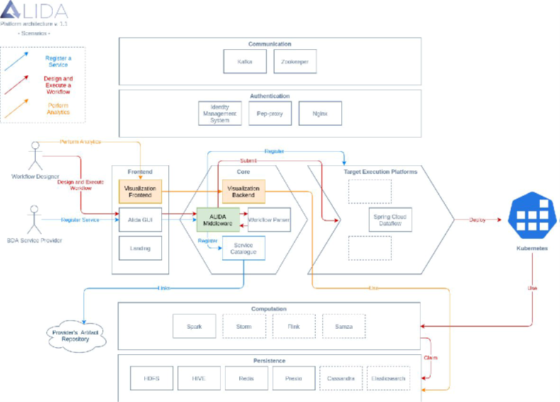
*Figure ********2.6****.********4****: Infinitech Contribution 02*

Redis is used by ALIDA to store some properties related to the platform and to serve the visualization component with the aim to create graphs and visualizations with real time updating capabilities. Last but not least, Kafka is adopted on various fronts: the platform, the core component of ALIDA, uses it to transmit and update the properties during the workflow execution phases. SCDF itself exploits it in the management of streams pipelines. ALIDA is cloud native software, this means that it can be seamlessly deployed both in an on-premises environment and on the cloud environments provisioned by the widely known providers such as Microsoft Azure, Amazon AWS and Google Cloud Platform. In the context of the INFINITECH project, ALIDA will be used in Pilot 10 to facilitate the development of real-time BDA service in the context of Cyber-Security for financial transactions.

Alida in the Project
This pilot aims at significantly improving the detection rate of malicious events (i.e., fraud attempts) and enabling the identification of security-related anomalies while they are occurring by the analysis in real-time of the financial transactions of a home and mobile banking system.

This approach thus allows proactive and prompt interventions on potential security threats. More specifically, Pilot 10 is developing a tool based on ML techniques applied to real-time, financial transaction data-streams focused on adaptive detection for malicious transactions leveraging on established big-data analytics’ practices.

The analysis of vast amounts of data will help to define relevant cyber-risk rating metrics and allow us to implement adaptive security measures and controls, based on real cyber-security postures.

Current implementation status on Pilot 10 is shown in *Figure **2.6**.**5**: Infinitech Contribution 03*.

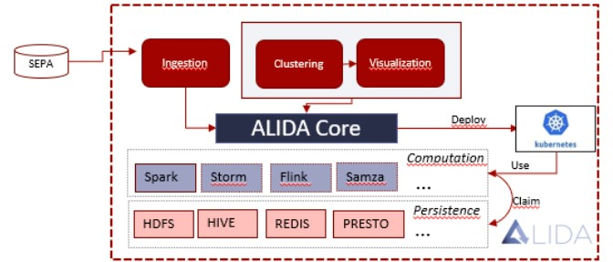
*Figure ********2.6****.********5****: Infinitech Contribution 03*

Poste Italiane create Synthetic and Realistic data set on “Bank Transfer SEPA” transactions that are consistent with the real data present in the data operations environment *Figure **2.6**.**6**: Infinitech Contribution 04*. These data sets are going to be used by Pilot 10 and, more in concrete, for the first PoC. To develop the services and workflows and ALIDA instance was deployed on ENG premise. As a Preliminary step: a job to transfer synthetic data set on “Bank Transfer SEPA” transactions from an SFTP server to ALIDA HDFS, was designed and it is up and running.

With the data ready to be processed, and using ALIDA, a first Batch processing/workflow has been created. This workflow converts qualitative fields into quantitative one, train a KMeans model and makes the clustering process. The Figure 31:shows developed ALIDA workflow based on three steps (string-indexer, trains the data with a KMeans models and the clustering creation).

After that, the data is grouped and visualized by clusters (*Figure **2.6**.**7**: Infinitech Contribution 05*).

Here a domain expert has to label which clusters would be suspicious of fraud. After that the Stream processing would start labelling and detecting new incoming data in real time. But this part is not implemented yet.

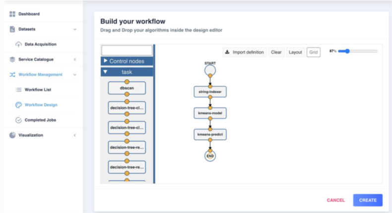
*Figure ********2.6****.********6****: Infinitech Contribution 04*

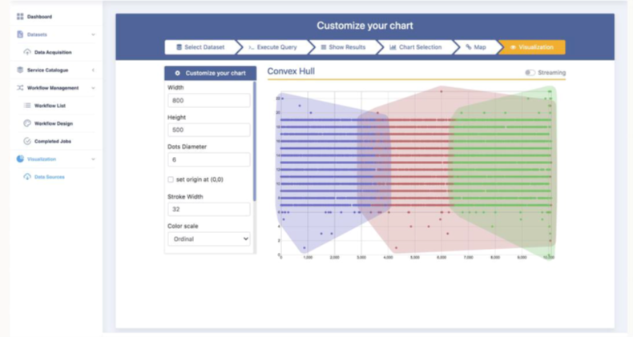
*Figure ********2.6****.********7****: Infinitech Contribution 05*

OK-INSAID

*Figure ********2.7****.********1****: **OK-INSAID Project Logo*

| ## **Type** | ## **Start Date** | ## **End Date** | ## **ENG Grant Amount** | ## **PM** |
| --- | --- | --- | --- | --- |
| CLOUD-EDGE | 1 Nove 2018 | 31 Marc 2022 | n.a. | n.a. |

*Table ********2.7****.********9****: *OK-INSAID Project Info

Partners

*Figure ********2.7****.********2****: OK-INSAID Partners Logos*

### ## **Partner Name**

**## **Acronym****: ## **Country**

### Engineering Ingegneria Informatica Spa

**ENG**: Italy

### EKA S.r.l.

**EKA**: Italy

### Università degli Studi di Palermo

**UNIPA**: Italy

### Università del Salento

**UNISAL**: Italy

### Consiglio Nazionale delle Ricerche

**CNR**: Italy

### Cefriel

**CEFRIEL**: Italy

### Tera S.r.l.

**TERA**: Italy

### Consorzio Calef

**CALEF**: Italy

### GE Avio S.r.l.

**GEA**: Italy

### SACMI

**SACMI**: Italy

*Table ********2.7****.********10****: OK-INSAID Partners*

Case Overview
In this case, the SACMI company that create ceramic slabs sends data to ALIDA in streaming. These data include information about the composition used for the creation of slabs and the results obtained about the quality of the stubs produced. ALIDA, through a **streaming BDA App (1)**, processes, cleans, and stores such data in a distributed store, fundamental for **Big Data **management.

In a later time, another **BDA App batch (2) **deals with training of a model based on collected data. An application puts on the edge (**Prediction**), near the data production site, **downloads from ALIDA the model **of the produced ML.

This model guides company operators to the composition of the procedure, based on input parameters.

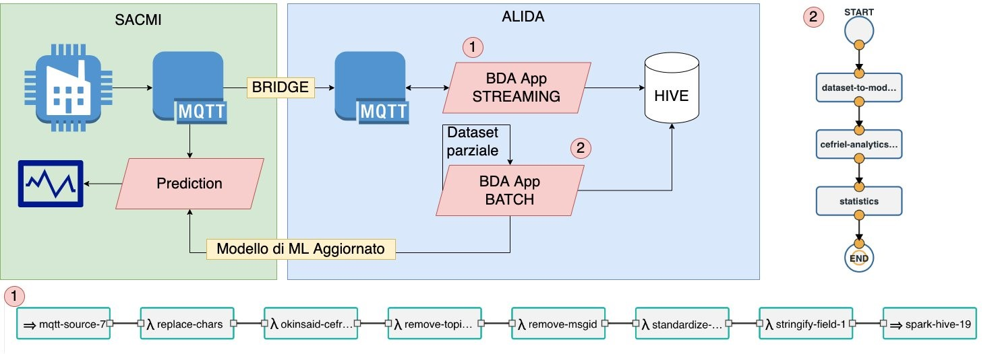
*Figure ********2.7****.********3****: OK-INSAID Contribution 01*

Zooming into Project
One of the most widely adopted quality management strategies today is Zero Defect Manufacturing (ZDM), a new paradigm aimed at surpassing traditional Six Sigma approaches through knowledge management, supported by new methodologies, technologies, and integrated tools for maintenance, quality control, and production logistics.

The general functional requirements of zero-defect manufacturing can be summarized as a system with the following capabilities:

Data collection via smart sensors,
Automatic signal processing, filtering, and feature extraction,
Data mining and knowledge discovery for diagnosis and prognosis,4. Providing clear and concise information and advice on defects to the user,
5. Self-adaptation and optimization control.

ZDM Monitoring systems highlight that, in order to achieve zero defect manufacturing, new cost-effective tools for monitoring and optimizing quality with multiple and autocorrelated data should be developed.

Therefore, it is necessary to manage processes in real-time based on inputs derived from simulation models to provide a clear and detailed understanding of the entire process and detect all possible causes of defects.

To achieve such digital representations, it is necessary to build a detailed and high-precision model capable of providing various options for identifying optimal product or process parameters.

The suggestion is to adopt Digital Twin technology during the production phase to optimize production planning and process control.

In SACMI’s production, the main components identified to better define an investigation in this regard concern porosity and the percentage of average penetration in the welding process.

The algorithms developed to predict the percentage values of penetration and porosity in laser welding have been uploaded to the online platform provided by the project, using the Docker system.

Alida in the Project
The entire predictive analysis pipeline, as designed, implemented, and extensively documented in previous project reports, consists of five fundamental steps (pipeline steps, abbreviated as PS):

Pre-processing of datasets, consisting of temporal reordering, cleaning, normalization, splitting into train/validation/test, and final saving of the divided files. **[PS1]**
Model training, exploring different training configurations (e.g., referring to model hyperparameters such as learning rate or the number of training epochs, among others, or the type of training); finally, saving the weights of the trained model. **[PS2]**
Validation of model performance, with the objective of selecting the best configuration based on calculated values for specific accuracy metrics, such as the well-known precision and recall; finally, saving the best parameters. **[PS3]**
Testing model performance, to evaluate the quality of predictions when they are made on new and unseen data, but whose true value is known (i.e., the true welding quality). **[PS4]**
Final prediction on completely new data that, according to what emerged during the project, are provided by the predictive models trained and tested by other partners. **[PS5]**
## **Services and Application**

The Alida Cloud microservices platform operates on two fundamental components, namely ”**services**” and ”**applications**.”

Specifically, one or many services constitute an application. The end user is responsible for launching an application, while the services represent something abstract and internal to the application itself.

In this context, the 5 PS were transferred and implemented as Python scripts within services. To achieve this, the PS were first grouped into:

**Dataset Preparation + Model Training + Validation [PS1] + [PS2] + [PS3] **we could call it as **S1;**
## **Model Testing [PS4] we could call it as S2;**

**Prediction on New Data [PS5]**we could call it as **S3.**
The three services implemented on the Alida microservices platform were transformed into Docker images to make them portable and host them on the popular Docker image hosting platform known as DockerHub. Indeed, to create a new service on the Alida Cloud platform, a JSON file containing all the characteristics and metadata of the service, including the reference to the Docker image uploaded on DockerHub, must be created.

Thus, a Python script was implemented and released for the partners involved in predictive analysis through the Alida Cloud platform, designed to generate the JSON configuration file.

Having uploaded the services as Docker images on DockerHub and generated the JSON files containing the metadata for each service, it was possible to create and upload the services on the Alida Cloud platform. They can be found on the platform as:

**[S1] poliba-fit-3-0 **- *Figure **2.7**.**4**: OK-INSAID Contribution 02* shows a screenshot of the parameters required by the service.

**[S2] poliba-test-3-0 **- *Figure **2.7**.**5**: OK-INSAID Contribution 03* shows a screenshot of the parameters required by the service.

**[S3] poliba-predict-3-6 **- *Figure **2.7**.**6**: OK-INSAID Contribution 04* shows a screenshot of the parameters required by the service.

Finally, as indicated previously, the three services were grouped to form two applications (named A1 and A2):

**[A1] **comprising S1+S2, for pre-processing, training, and testing - *Figure **2.7**.**7**: OK-INSAID Contribution 05* shows a screenshot of the execution of application A1.

**[A2] **comprising S3, consisting of prediction on new data - *Figure **2.7**.**8**: OK-INSAID Contribution 06* shows a screenshot of the execution of application A2.

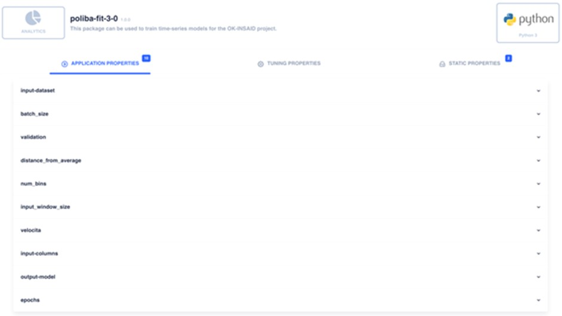
*Figure ********2.7****.********4****: OK-INSAID Contribution 02*

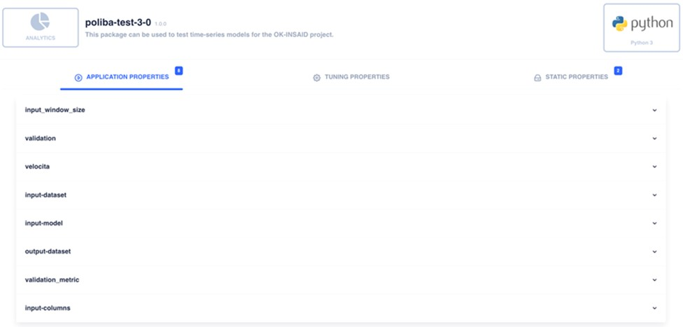
*Figure ********2.7****.********5****: OK-INSAID Contribution 03*

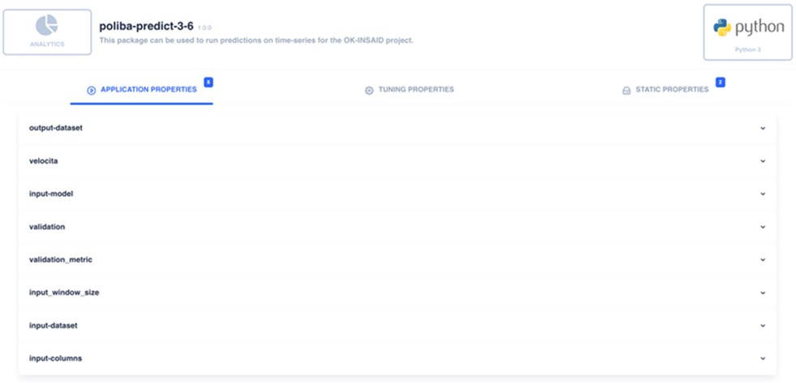
*Figure ********2.7****.********6****: OK-INSAID Contribution 04*

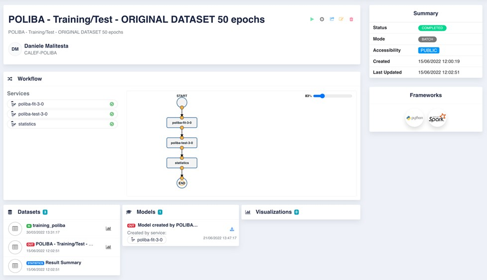
*Figure ********2.7****.********7****: OK-INSAID Contribution 05*

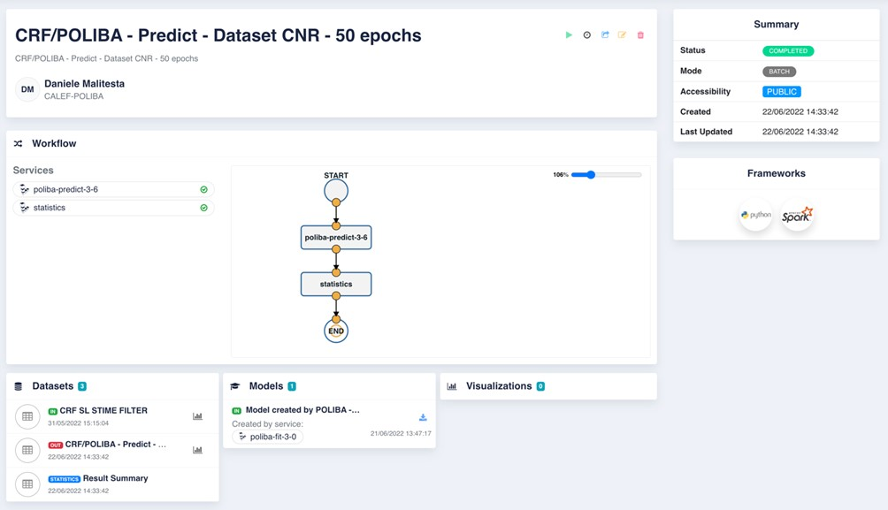
*Figure ********2.7****.********8****: OK-INSAID Contribution 06*

ICARUS

*Figure ********2.8****.********1****: ICARUS Project Logo*

| ## **Type** | ## **Start Date** | ## **End Date** | ## **ENG Grant Amount** | ## **PM** |
| --- | --- | --- | --- | --- |
| ML-OPS | 1 Janu 2018 | 30 June 2021 | n.a. | n.a. |

*Table ********2.8****.********11****: ICARUS Project Info*

Partners

*Figure ********2.8****.********2****: ICARUS Partners Logo*

### ## **Partner Name**

**## **Acronym****: ## **Country**

### Engineering Ingegneria Informatica Spa

**ENG**: Italy

### PACE AEROSPACE ENGINEERING AND INFORMATION TECHNOLOGY GMBH

**PACE**: Germany

### SUITE5 DATA INTELLIGENCE SOLUTIONS LIMITED

**SUITE5**: Ireland

### UNIVERSITY OF CYPRUS

**UNICYP**: Cyprus

### CINECA CONSORZIO INTERUNIVERSITARIO

**CCI**: Italy

### OAG AVIATION WORLDWIDE LIMITED

**OAG**: UK

### SINGULARLOGIC ANONYMI ETAIREIA PLIROFORIAKON SYSTIMATON KAI EFARMOGONPLIROFORIKIS

**SINGUL**: Greece

### ISTITUTO PER L’INTERSCAMBIO SCIENTIFICO

**IIS**: Italy

### CELLOCK LTD

**CELLOCK**: Cyprus

### ATHENS INTERNATIONAL AIRPORT S.A.

**AIA**: Greece

### SUITE5 DATA INTELLIGENCE SOLUTIONS Ltd

**SDIS**: Cyprus

*Table ********2.8****.********12****: ICARUS Partners*

Case Overview
The European aviation industry faces a surge of multi-source and multi-lingual data. The EU-funded ICARUS project will build a novel data value chain in aviation-related sectors aimed at data-driven innovation and collaboration across industry players. Using methods such as big data analytics, deep learning, semantic data enrichment and blockchain-powered data sharing, ICARUS aims to develop a multi-sided platform allowing integration and deep analysis of data for EU-based companies, organisations and scientists. ICARUS will bring together the aerospace, tourism, health, security, transport, retail, weather and public sectors and accelerate their data-driven collaboration.

Zooming into Project
Industries of all types are using the power of big data and analytics to fundamentally transform how they do business. The notable exception is the aviation industry. In fact, there is currently little data diffusion and sharing between the different stakeholders of the aviation-related sectors.

“The European aviation industry needs to leverage the surge of multisource data in order to gain augmented intelligence and open the door to a range of unprecedented services,” says Dimitrios Alexandrou, business innovation director at UBITECH, a Greek technology company.

With a focus on building a data value chain, the EU-funded ICARUS (Aviation driven Data Value Chain for Diversified Global and Local Operations) project is helping the aviation industry embrace data-driven innovation. “Using big data analytics, deep learning, data enrichment, and blockchain-powered data sharing, the ICARUS project aims to deliver a unique data and intelligence platform for the aviation industry,” adds Alexandrou, who serves as the project coordinator.

A one-stop shop for aviation data and intelligence The objective of the project

is to conceptualise, design and develop the ICARUS platform. When finalised, the platform will enable data exploration, blockchain-empowered sharing, and the brokerage of a large variety of heterogeneous data sources. It will also serve as a one stop shop for aviation data and intelligence – covering the entire big data lifecycle, from data collection to curation, exploration, integration and analysis.

“The platform will provide users with a deeper understanding of, for example, flight optimisation, pollution awareness, tourism operations, the passenger experience – even how aviation can cause an epidemic to spread,” explains Alexandrou. “As such, it will be an invaluable tool for the aviation industry, aviation-related service providers, and other cross-sectoral stakeholders.”

The platform will also serve as a trusted and secure sandbox-style workspace where users can conduct analytical experiments in a safe and confidential closedlab environment. “The ICARUS platform aims to address the security and privacy concerns that have made the aviation industry and related industries reluctant to leverage big data technologies,” notes Alexandrou.

According to him, the platform has already received expressions of interest from a number of external stakeholders.

Enabling data-driven innovation and collaboration Despite some delays caused by COVID-19, the ICARUS project succeeded in creating a platform that enables data-driven innovation and collaboration across the aviation sector.

“The ICARUS platform effectively addresses the industry’s reluctance to explore, curate, share, trade, integrate and deeply analyse big data in a trusted and fair manner,” concludes Alexandrou. “In other words, it provides the big data that will drive the design and implementation of the innovative new services that will disrupt the aviation industry.”

The platform will soon be available in beta format. Project researchers are currently exploring the best business plan for bringing the platform to market.

Agritech

*Figure ********2.9****.********1****: Agritech Project Logo*

| ## **Type** | ## **Start Date** | ## **End Date** | ## **ENG Grant Amount** | ## **PM** |
| --- | --- | --- | --- | --- |
| ML-OPS | Dece 2021 | May 2024 | n.a. | n.a. |

*Table ********2.9****.********13****: Agritech Project Info*

Partners

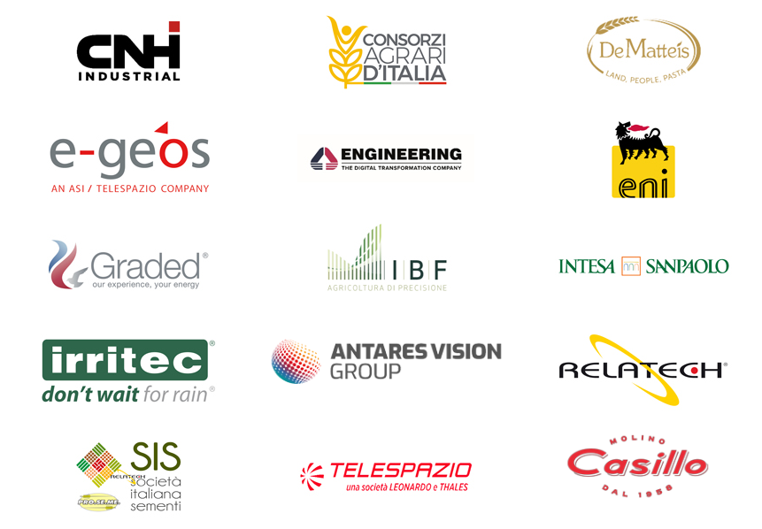
*Figure ********2.9****.********2****: Agritech Partners Logo*

### ## **Partner Name**

**## **Acronym****: ## **Country**

### Engineering Ingegneria Informatica Spa

**ENG**: Italy

### Consiglio Nazionale delle Ricerche

**CNR**: Italy

### Università degli Studi di Bari

**UNIBA**: Italy

### Alma Mater Studiorum – Università di Bologna

**UNIBO**: Italy

### Università degli Studi di Milano

**UNIMI**: Italy

### Università di Napoli Federico II

**UNINA**: Italy

### Università di Padova

**UNIPD**: Italy

### Università di Siena

**UNISI**: Italy

### Università degli Studi di Torino

**UNITO**: Italy

### Centro Euro-Med sui Cambiamenti Climatici

**CMCC**: Italy

### Consiglio per la ricerca in agricoltura e l’analisi dell’economia agraria

**CREA**: Italy

### New Technologies, Energy and

Sustainable Economic Development

**ENEA**: Italy

### Fondazione Edmund Mach

**FEM**: Italy

### Politecnico di Milano

**POLIMI**: Italy

### Politecnico di Torino

**POLITO**: Italy

### Scuola Superiore Sant’Anna

**SSSA**: Italy

### Università degli Studi della Basilicata

**UNIBAS**: Italy

### Università di Bolzano

**UNIBZ**: Italy

### Università Campus Bio-Medico di Roma

**UCBM**: Italy

### Università Cattolica del Sacro Cuore

**UCSC**: Italy

### Università di Catania

**UNICT**: Italy

### Università di Foggia

**UNIFG**: Italy

### Università di Firenze

**UNIFI**: Italy

### Università degli Studi di Genova

**UNIGE**: Italy

### Università di Perugia

**UNIPG**: Italy

### Università di Pisa

**UNIPI**: Italy

### Università di Parma

**UNIPR**: Italy

### Università di Reggio Calabria

**UNIRC**: Italy

### Sapienza Università di Roma

**UNIROMA**: Italy

### Università di Salerno

**UNISA**: Italy

### Università di Sassari

**UNISS**: Italy

### Università di Udine

**UNIUD**: Italy

### Università delle Marche

**UNIVPM**: Italy

*Table ********2.9****.********14****: Agritech Partners*

Case Overview
As part of a project within the National Recovery and Resilience Plan (PNRR), there is a need for a use case to train a model that, based on the movements of a cow (monitored through an IoT collar), validates whether the growth occurs outdoors or indoors in a stable.

In addition to creating the ML model and managing its entire lifecycle, ALIDA will also validate satellite data on a blockchain and provide analytical results to a traceability system that will expose the outcome during the scanning phase of the QR code displayed on the finished product.

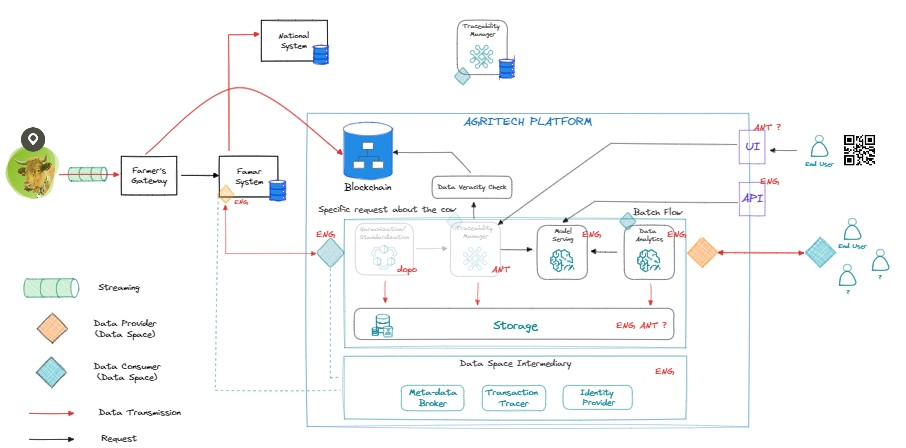
*Figure ********2.9****.********3****: Agritech Contribution 01*

Zooming into Project
In the context of an **Agritech** project, ALIDA can offer tools and methods to efficiently manage and analyze large amounts of agricultural data. Here’s how you could use ALIDA in an Agritech project (*Figure **2.9**.**3**: Agritech Contribution 01*):

Data Collection and Preprocessing
ALIDA can assist in collecting data from various sources such as IoT sensors, satellite images, and existing databases. Additionally, it provides tools for data preprocessing:

Data Cleaning: Removing missing or anomalous data.
Data Normalization: Adjusting data to ensure uniformity.
Data Integration: Combining data from different sources.
Data Analysis
ALIDA offers numerous algorithms for analyzing agricultural data:

Statistical Analysis: To understand trends in crop yield data, climate data, etc.
Predictive Analysis: Using machine learning models to predict crop yields, plant diseases, and other relevant metrics.
Spatial Analysis: For analyzing geographic data, such as land maps and crop distribution.
Data Visualization
Effectively visualizing data is crucial for making informed decisions. ALIDA provides tools to create:

Interactive Charts: To dynamically explore data.
Thematic Maps: To visualize crop distribution, soil moisture, and other geospatial variables.
Customized Dashboards: To monitor key metrics in real-time.
Process Automation
In the context of Agritech, automation can increase efficiency:

Automated Data Collection: Using sensors and drones to collect data automatically.
Automated Analysis: Configuring analysis pipelines that automatically perform predictive analyses on new data.
Automated Decision-Making: Implementing decision support systems that use analysis results to suggest actions.
Specific Applications
Crop Monitoring: Using sensor data and satellite images to monitor crop health and identify issues early.
Irrigation Management: Analyzing soil moisture data and weather forecasts to optimize water use.
Crop Planning: Using predictive models to plan crop rotation and maximize yields.
Pest Management: Analyzing data to predict and prevent pest infestations.
Alida in the Project
Example of Using ALIDA in an Agritech Project

Imagine an Agritech project aiming to optimize corn production. Here’s how you could use ALIDA:

Data Collection:
Collect data from soil moisture sensors, weather stations, and satellite images.

Preprocessing:
Clean and normalize the data to ensure quality.

Predictive Analysis:
Use machine learning algorithms to predict corn yields based on future weather conditions.

Visualization:
Create maps and charts showing yield predictions and water stress areas.

Automation:
Implement a system that sends notifications to farmers when it’s time to irrigate or fertilize based on predictions and real-time data.

In conclusion, ALIDA can be a powerful tool in an Agritech project, offering advanced functionalities for data collection, analysis, visualization, and automation to improve agricultural efficiency and productivity.

Part II

User Guide

Data Access*
*(*****ChatGPT** **and CoPilot**)*

Enterprise Application Integration
Definition
Enterprise Application Integration (EAI) is a strategic approach to connect systems, applications, and data within an organization to improve communication, efficiency, and productivity. EAI enables enterprises to integrate heterogeneous software and data silos, creating an interoperable infrastructure.

It refers to the process of connecting the many business applications (such as ERP, CRM, SCM, and others) to enable smooth data exchange and functionality. The aim is to eliminate barriers between systems, reduce data duplication, and improve workflow.

In ALIDA
[…]

Data Replication and Synchronization
Data replication and synchronization are critical concepts in distributed systems, database management, and cloud computing. They enable consistency, fault tolerance, high availability, and scalability across systems. Here's a breakdown:

Data Replication
**Definition**: The process of copying data from one location to another, typically across different servers, databases, or regions.

## **Purpose:**

**Fault Tolerance**: Ensures data availability even if a node or server fails.
**High Availability**: Provides access to data from multiple locations.
**Performance**: Improves read performance by enabling users to access data from a replica closer to them.
**Backup and Recovery**: Creates redundancy for disaster recovery.
## **Types of Replication:**

**Synchronous Replication**:
Changes are immediately propagated to all replicas.
**Pros**: Ensures data consistency.
**Cons**: Higher latency due to waiting for acknowledgments from replicas.
Example: Financial systems.
**Asynchronous Replication**:
Changes are propagated to replicas after the primary operation is complete.
**Pros**: Lower latency for the primary operation.
**Cons**: Risk of eventual inconsistency.
Example: Content delivery networks (CDNs).
## **Challenges:**

**Consistency**: Maintaining uniform data across replicas (solved by algorithms like Paxos or Raft).
**Latency**: Balancing performance and real-time updates.
**Conflict Resolution**: Handling updates that conflict between replicas.
Data Synchronization
**Definition**: The process of ensuring data consistency between multiple systems or replicas over time.

## **Purpose:**

Keeps all copies of data consistent after updates, modifications, or deletions.
Ensures that users see the same data across different systems or devices.
## **Approaches to Synchronization:**

**One-Way Synchronization**:
Data flows in a single direction (e.g., master-to-slave).
Useful for backups or simple replication.
**Two-Way Synchronization**:
Data flows bidirectionally between systems.
Example: Collaborative tools like Google Docs.
**Near Real-Time Synchronization**:
Updates are synchronized almost instantaneously after changes.
Useful for systems requiring high consistency.
**Scheduled Synchronization**:
Data is synchronized at predetermined intervals (e.g., nightly batch updates).
Suitable for low-priority or high-latency applications.
## **Techniques:**

**Change Data Capture (CDC)**: Tracks changes in a source system to propagate updates.
**Conflict Resolution**: Algorithms to address data inconsistencies during synchronization.
**Version Control**: Ensures the correct sequence of updates (e.g., timestamps or vector clocks).

### Aspect

**Replication**: Synchronization

### Scope

**Copies data to multiple locations.**: Ensures consistency across locations.

### Directionality

**Often one-way (primary to replica).**: Can be one-way or two-way.

### Real-Time Need

**Often synchronous or asynchronous.**: Typically focuses on eventual consistency.

### Goal

**Redundancy and availability.**: Consistency and coordination.

Table 1.2.2 - Key Differences Between Replication and Synchronization

## **Use Cases**

**Replication**: Content delivery networks (CDNs), disaster recovery, cloud database mirroring.
**Synchronization**: Multi-device applications, distributed databases, real-time collaboration platforms.

In ALIDA
[…]

Basic and Advanced ETL Functionality
Extract, Transform, Load (ETL) functionality plays a pivotal role in data integration, ensuring data from diverse sources is consolidated, cleaned, and made ready for analysis. Below is a breakdown of **basic** and **advanced ETL functionalities**.

Basic ETL Functionality
Basic ETL processes address fundamental data integration needs, focusing on simplicity and standard operations.

Extract
**Purpose**: Retrieve raw data from source systems (structured or unstructured).
**Features**:
Support for standard data sources: Relational databases, flat files (e.g., CSV, JSON, XML), APIs, etc.
Minimal source system impact: Lightweight data extraction techniques.
Full or incremental extraction.
Transform
**Purpose**: Convert raw data into a usable format.
**Features**:
Data cleaning: Removing duplicates, fixing errors, and handling missing values.
Basic transformations: Data type conversions, aggregations (e.g., sums, averages), and filtering.
Lookups: Mapping reference data or joining datasets.
Load
**Purpose**: Load transformed data into a target system.
**Features**:
Support for common data destinations: Data warehouses, databases, or flat files.
Basic scheduling: Loading data at periodic intervals (batch processing).
Overwrite or append operations.
Common Use Cases:

Migrating data from operational databases to a centralized data warehouse.
Basic reporting and dashboards.
Small-scale projects with limited data complexity.

Advanced ETL Functionality
Advanced ETL processes address complex data integration needs, emphasizing scalability, real-time capabilities, and intelligent automation.

Advanced Extract
**Purpose**: Handle diverse and complex data sources.
**Features**:
Support for modern data formats: NoSQL databases, streaming data (e.g., Kafka), cloud services, and IoT devices.
Change Data Capture (CDC): Extract only data changes to optimize performance.
Data profiling: Analyse source data to understand quality and structure.
Advanced Transform
**Purpose**: Enable sophisticated and intelligent data transformations.
**Features**:
Data enrichment: Augment data with external sources (e.g., adding geolocation data).
Advanced data cleaning: AI/ML-based anomaly detection and correction.
Complex transformations:
Advanced joins (e.g., fuzzy matching).
Hierarchical data processing.
Pivoting and unpivoting.
Metadata management: Track data lineage and transformation history.
Event-driven transformations: Trigger specific workflows based on data events.
Advanced Load
**Purpose**: Optimize data delivery and usability in the target system.
**Features**:
Support for real-time and streaming loads (ETL evolves into ELT or Streaming ETL).
Partitioning and indexing: Improve query performance in the target system.
Scalability: Handle large-scale data loads in distributed systems (e.g., Hadoop, Spark).
Data validation: Post-load validation to ensure data integrity.
Upset operations: Update existing records or insert new ones.
Automation & Orchestration
Workflow automation tools (e.g., Apache Airflow, AWS Step Functions).
Event-based ETL pipelines.
Error handling and recovery mechanisms.
Advanced Scalability & Performance
Parallel processing for large datasets.
Cloud-native capabilities (e.g., Snowflake, AWS Glue).
Distributed ETL frameworks for big data (e.g., Apache Spark).
Security & Governance
Data encryption during transfer and storage.
Role-based access control (RBAC).
Compliance features for regulations like GDPR, HIPAA, or CCPA.
Integration with Modern Architectures
ELT workflows for big data (using tools like BigQuery, Databricks).
Data mesh support: Decentralized data processing across domains.
Integration with CI/CD pipelines for DevOps workflows.
## **Common Use Cases:**

Real-time analytics for IoT or streaming platforms.
Enterprise-level data warehouses.
AI/ML model training pipelines.

## **Comparison: Basic vs. Advanced ETL**

### Aspect

**Basic ETL**: Advanced ETL

### Data Sources

**Relational databases, files**: NoSQL, APIs, streaming, IoT, cloud

### Data Volume

**Small to moderate**: Large-scale and distributed

### Processing

**Batch processing**: Batch, real-time, streaming

### Transformation

**Simple cleaning, aggregations**: Complex, AI-driven transformations

### Scalability

**Limited**: Highly scalable (cloud/distributed)

### Governance

**Minimal**: Advanced security and compliance

In ALIDA
[…]

Hybrid and Multi Cloud Data Sources
Hybrid and multi-cloud strategies are increasingly popular for managing data sources in modern IT environments. Here’s a brief overview of each:

Hybrid Cloud
A hybrid cloud combines on-premises infrastructure (private cloud) with public cloud services. This setup allows data and applications to move between the two environments, providing greater flexibility and more deployment options. [Hybrid clouds are often used to meet regulatory requirements, maximize existing infrastructure investments, and reduce latency by processing data closer to where it is generated](https://learn.microsoft.com/en-us/azure/cloud-adoption-framework/scenarios/hybrid/).

Multi-Cloud
Multi-cloud refers to the use of multiple cloud services from different providers. This approach allows organizations to choose the best services for specific tasks, enhancing flexibility and reducing dependency on a single vendor. [Multi-cloud environments can include both public and private clouds, offering a heterogeneous setup that can be tailored to various business needs](https://www.cloudflare.com/learning/cloud/multicloud-vs-hybrid-cloud/)[2](https://www.cloudflare.com/learning/cloud/multicloud-vs-hybrid-cloud/).

## **Key Benefits**

Flexibility: Both strategies offer the ability to scale resources up or down based on demand.
Risk Mitigation: Using multiple providers can reduce the risk of downtime and data loss.
Cost Efficiency: Organizations can optimize costs by selecting the most cost-effective services for different workloads.
[Compliance and Security: Hybrid clouds can help meet regulatory requirements by keeping sensitive data on-premises while leveraging the public cloud for less sensitive workloads](https://learn.microsoft.com/en-us/azure/cloud-adoption-framework/scenarios/hybrid/)[1](https://learn.microsoft.com/en-us/azure/cloud-adoption-framework/scenarios/hybrid/).
## **Popular Platforms**

[Google Cloud: Offers tools for building hybrid and multi-cloud architectures, enabling seamless integration and management of data across different environments](https://learn.microsoft.com/en-us/azure/cloud-adoption-framework/scenarios/hybrid/)[3](https://cloud.google.com/architecture/hybrid-multicloud-patterns-and-practices).
[Microsoft Azure: Provides comprehensive support for hybrid and multi-cloud setups, with features designed to enhance security, compliance, and operational efficiency](https://learn.microsoft.com/en-us/azure/cloud-adoption-framework/scenarios/hybrid/)[1](https://learn.microsoft.com/en-us/azure/cloud-adoption-framework/scenarios/hybrid/).
Amazon Web Services (AWS): Supports hybrid cloud solutions with services like AWS Outposts, which bring AWS infrastructure and services to on-premises environments.

Access to Nontraditional Data Types
Accessing nontraditional data types can provide unique insights and enhance data-driven decision-making. Here are some examples of nontraditional data sources and their applications:

Geospatial Data
Satellite Imagery: Used for monitoring environmental changes, urban development, and agricultural patterns.

Geographic Information Systems (GIS): Helps in mapping and analyzing spatial data for various applications, including disaster management and urban planning.

Mobile Phone Data
Location Data: Tracks population movements and mobility patterns, useful for urban planning and transportation studies.

Call Detail Records (CDRs): Analyzes communication patterns and can be used in epidemiology to track disease spread.

Social Media Data
Sentiment Analysis: Analyzes public opinion on various topics, such as product reviews or political sentiments.

Trend Analysis: Identifies emerging trends and patterns in real-time, useful for market research and public health monitoring.

Sensor Data
Internet of Things (IoT): Collects data from connected devices, such as smart meters, weather stations, and health monitors.

Environmental Sensors: Monitors air quality, water quality, and other environmental parameters.

Citizen-Generated Data
Crowdsourcing Platforms: Gathers data from the public on various issues, such as traffic conditions, disaster response, and public health.

Participatory Mapping: Involves communities in mapping their own areas, providing valuable local insights.

Transaction Data
E-commerce Data: Analyzes purchasing behavior and trends from online transactions.

Financial Data: Tracks economic activities and can be used for market analysis and financial forecasting.

These nontraditional data sources can complement traditional data collection methods, offering richer and more diverse datasets for analysis.

Connectivity to Data Lake Infrastructure
Connecting to data lake infrastructure is crucial for managing and analyzing large volumes of data. Here are some key steps and considerations for establishing connectivity:

Choose the Right Data Lake Platform
*Azure Data Lake Storage (ADLS):* Offers scalable storage and supports big data analytics. You can connect to ADLS using various tools like Azure Databricks, which provides seamless integration and powerful data processing capabilities.

*Amazon S3*: Widely used for data lakes, S3 integrates with AWS analytics services like Amazon Redshift and AWS Glue. It supports a wide range of data formats and provides robust security features.

*Google Cloud Storage*: Suitable for building data lakes on Google Cloud, it integrates with BigQuery for analytics and supports various data ingestion methods.

Set Up Authentication and Access Control
*Service Principals and IAM Roles*: Use service principals (Azure) or IAM roles (AWS and Google Cloud) to manage access to your data lake. This ensures secure and controlled access to data.

*OAuth 2.0*: Implement OAuth 2.0 for secure authentication, especially when connecting from external applications or services.

Data Ingestion and Integration
*ETL Tools*: Use Extract, Transform, Load (ETL) tools like Apache NiFi, Talend, or AWS Glue to ingest data into your data lake. These tools help automate data pipelines and ensure data is properly formatted and cleaned.

*Streaming Data*: For real-time data ingestion, use tools like Apache Kafka or AWS Kinesis. These tools allow you to process and analyze data as it arrives.

Data Management and Governance
*Metadata Management*: Implement a metadata management system to catalog and organize your data. Tools like Apache Atlas or AWS Glue Data Catalog can help with this.

*Data Governance*: Establish data governance policies to ensure data quality, security, and compliance. This includes setting up data access controls, auditing, and monitoring.

Analytics and Processing
*Big Data Processing*: Use platforms like Apache Spark, Databricks, or Google BigQuery for processing and analyzing large datasets. These platforms offer powerful analytics capabilities and can handle complex queries.

*Machine Learning*: Integrate machine learning frameworks like TensorFlow, PyTorch, or AWS SageMaker to build and deploy machine learning models on your data lake.

By following these steps, you can effectively connect to and utilize data lake infrastructure for your big data and analytics needs.

Data Lineage
Data lineage refers to the process of tracking and visualizing the flow of data from its origin through various transformations and stages until it reaches its final destination. This practice is crucial for ensuring data quality, compliance, and effective data governance. Here are some key aspects of data lineage:

Importance of Data Lineage
*Traceability*: Helps in understanding the data’s journey, making it easier to identify and rectify errors.

*Compliance*: Ensures that data handling complies with regulatory requirements by providing a clear audit trail.

*Data Quality*: Enhances data quality by allowing organizations to track and manage data transformations and dependencies.

Components of Data Lineage
*Data Origin*: The source of the data, such as databases, files, or external systems2.

Transformations: The processes that modify the data, including cleaning, aggregating, and enriching.

*Data Flow*: The movement of data through various systems and processes2.

End Points: The final destinations where the data is stored or used, such as data warehouses, analytics platforms, or reports.

Tools for Data Lineage
*Apache Atlas*: An open-source tool for managing metadata and data lineage in Hadoop ecosystems.

*Informatica*: Provides comprehensive data lineage capabilities, supporting various data sources and transformations.

*Talend*: Offers data lineage features as part of its data integration and management suite.

*Collibra*: A data governance platform that includes robust data lineage tracking1.

Benefits of Data Lineage
*Improved Decision-Making*: Provides a clear understanding of data origins and transformations, leading to more informed decisions.

*Enhanced Data Governance*: Facilitates better data management practices and compliance with regulations.

*Operational Efficiency*: Streamlines data operations by providing visibility into data flows and dependencies.

Implementing data lineage can significantly improve how organizations manage and utilize their data.

Data Governance and Metadata Management
Data governance and metadata management are essential components for ensuring data quality, compliance, and effective data utilization within an organization. Here’s an overview of each and how they work together:

Data Governance
Data governance involves the overall management of data availability, integrity, and security. It includes establishing policies, procedures, and guidelines to ensure proper data handling and utilization. Key components of data governance include:

*Data Stewardship*: Assigning roles and responsibilities for managing data quality and integrity.

*Data Quality Management*: Ensuring data is accurate, consistent, and up-to-date.

*Data Security*: Implementing measures to protect sensitive information from unauthorized access or breaches.

*Compliance*: Meeting regulatory requirements, such as data privacy laws and industry-specific regulations.

Metadata Management
Metadata management involves organizing and categorizing metadata, which is data about data. Metadata provides context and information about data assets, such as their origin, structure, and usage. Key aspects of metadata management include:

*Business Metadata*: Information that provides business context, such as data definitions, classifications, and confidentiality levels.

Technical Metadata: Details about data structure, storage, and transformations, such as table names, column structures, and data lineage.

*Metadata Cataloging*: Creating a searchable index of metadata to facilitate data discovery and access.

Synergy Between Data Governance and Metadata Management
The integration of data governance and metadata management enhances data-driven decision-making and operational efficiency. Here’s how they complement each other:

*Improved Data Quality*: Metadata management helps in tracking data transformations and lineage, ensuring data quality and consistency.

*Enhanced Compliance*: Data governance policies, combined with metadata management, ensure that data handling complies with regulatory requirements.

*Better Data Utilization*: Metadata provides the context needed to understand and use data effectively, while data governance ensures that data is managed and utilized properly.

By implementing robust data governance and metadata management practices, organizations can unlock the full potential of their data assets.

API-Based Access to Web Data
API-based access to web data is a powerful method for retrieving and interacting with data from various online sources. Here’s an overview of how it works and some tools you can use:

How API-Based Access Works
*API Requests*: APIs (Application Programming Interfaces) allow you to send requests to a web server to retrieve or manipulate data. These requests are typically made using HTTP methods like GET, POST, PUT, and DELETE.

*Data Formats*: The data returned by APIs is often in formats like JSON or XML, which are easy to parse and use in your applications.

*Authentication*: Many APIs require authentication, usually through API keys, OAuth tokens, or other methods to ensure secure access.

Popular Tools and Libraries
*Python Requests Library*: A simple and popular library for making HTTP requests in Python. It’s great for interacting with web APIs and handling responses.

*Postman*: A powerful tool for testing and interacting with APIs. It allows you to create and save complex API requests and view responses in a user-friendly interface.

*Swagger*: An open-source framework for designing, building, and documenting APIs. It helps in creating interactive API documentation and testing endpoints.

Use Cases
*Data Integration*: APIs can be used to integrate data from various sources into a centralized database or data warehouse.

*Real-Time Data Access*: APIs enable real-time access to data, which is crucial for applications that require up-to-date information.

*Automation*: Automate repetitive tasks by using APIs to interact with web services and perform actions programmatically.

Learning Resources
*Dataquest*: Offers courses on APIs and web scraping in Python, providing practical skills for extracting and analyzing web data.

*freeCodeCamp*: Provides tutorials on how to use web APIs in coding projects, helping you understand the basics and advanced concepts.

API-based access to web data can significantly enhance your data analysis and integration capabilities.

Data Preparation
Data Blending/Wrangling
In **Machine Learning** and **Data Science**, the concepts of **Data Blending** and **Data Wrangling** refer to two distinct but complementary processes for data preparation.

Data Wrangling (or Data Munging)

**Data Wrangling** is the process of **cleaning, transforming, and restructuring** raw data into a format best suited for analyzing and training machine learning models.

**Data cleansing**: Managing missing values, eliminating duplicates, correcting errors in data.
**Standardization**: conversion of units of measurement, normalization of values.
**Feature Engineering**: Creating new features from existing features.
**Formatting**: Converting data types, restructuring columns and rows.

👉 **Goal**: Make data usable for analysis or predictive models.

Data Blending

**Data Blending** is the process of **combining data from different sources** (e.g., databases, CSV files, APIs, etc.), and merging them to create a unified dataset. It differs from simple **Data Integration** because it allows you to combine heterogeneous data without necessarily structuring them in the same database.

The most common techniques include:

**Join (INNER, LEFT, RIGHT, FULL)**: A union of datasets based on common keys.
**Union**: A concatenation of datasets with a similar structure.
**Lookup & Matching**: data enrichment based on identifiers.
👉 **Goal**: Merge data from multiple sources to gain richer insights.

Key Difference

### ## **Aspect**

**## **Data Wrangling****: ## **Data Blending**

### ## **Objective**

**Data Cleansing and Transformation**: Merging data from multiple sources

### ## **Focus**

**Data quality and structure**: Merging heterogeneous datasets

### ## **Techniques used**

**Normalization, feature engineering, missing value management**: Join, union, lookup

Practical example

Imagine you have:

A file with monthly sales (**CSV**)
A database with customer information (**SQL)**
Marketing data collected via **API**
With **Data Blending**, you combine these sources to get a single dataset.
With **Data Wrangling**, clean up the dataset (removing errors, transforming variables, handling missing data).

Data Augmentation
**D****ata Augmentation** is a technique used to **artificially increase the amount of data** available for training a model, creating new instances of the original data through transformations, modifications, or synthetic generation.

**Goal**: Improve model generalization, reduce overfitting, and achieve better performance, especially when the dataset is limited.

## **Data Augmentation in the different areas**

## **1️⃣ Computer Vision (Images)**

In computer vision, **Data Augmentation** is widely used to generate multiple images from existing ones. Common techniques include:

**Flip and rotation** (horizontal/vertical mirror, rotation of random angles)
**Zoom and crop** (zoom in or crop portions of the image)
**Translation and distortion** (displacement, elastic deformation)
**Adding noise** (to simulate real-world variations)
## **Changing brightness and contrast**

**Generation of synthetic data** (e.g. GAN - Generative Adversarial Networks)
📌 **Example**: In a dataset of cat images, you can create new images by rotating them or applying filters to simulate different lighting conditions.

## **2️⃣ Natural Language Processing (NLP)**

In text, **Data Augmentation** can be more complex because editing a sentence without altering its meaning is difficult. Some techniques include:

**Synonym Replacement** (replacing words with synonyms)
**Back Translation** (translation into another language and return to the original)
**Sentence Shuffling** (change in word order)
**Word Dropout** (random word removal)
**Generation with language models** (e.g. GPT to create new similar texts)
📌 **Example**: The phrase *"The dog runs in the park"* can be increased to *"The dog sprints in the garden"* by synonyms.

## **3️⃣ Tabular Data (Structured Data)**

In tabular datasets, Data Augmentation is more complex, but can be accomplished with:

**Jittering** (adding small random noises to numerical data)
**Synthetic Minority Over-sampling Technique (SMOTE)**
**Statistical perturbations** (random changes to the data while maintaining the original distribution)
📌 **Example**: If you have little data from high-income customers, SMOTE can generate new synthetic examples to improve class balance.

## **Benefits of Data Augmentation**

**🔍**** ****Improves model** **generalization **

**🔍**** ****Reduces overfitting**, especially with small **datasets **

**🔍**** ****Increases model robustness** to variations in real **data **

**🔍**** ****Allows you to better leverage deep learning models**, which require large amounts of data.

## **Limitations and Challenges**

⚠ **Not always effective for all data**⚠ T**ypes Risk of introducing bias or noise** if augmentation is poorly designed⚠ **Increased training time**, especially with images and text.

Data Quality Support
Dataset Partitioning
Binning and Smoothing
Filter and Search
Feature Generation
Official Watermarking of Datasets
Basic Data Catalogue
Data Labelling/Annotation
Transformations, Aggregation and Set Operations
Data Enrichment
Augmented Data Preprocessing
Augmented Data Preparation
Cloud, Hybrid and Multicloud Support

Data Exploration and Visualisation <omissis>
Univariate and Bivariate Statistics
Statistical Significance Testing
Signal Preprocessing
Data Visualizations
Exporting Results
Custom Visualization
Clustering and Self-Organizing Maps
Geolocation Mapping
Affinity and Graph Analysis
Conjoint and Survey Analysis
Density Estimation
Similarity Metrics
Augmented Data Discovery
On-Premises
Cloud, Multicloud and Hybrid

User Interface
Ease of Use and Learning Curve
Developer-Focused Data Science
NLP Q&A
Documentation
User Community
Third-Party Applications
Visual Pipelining or Visual Composition Framework
Wizards and Contextual Aids <start again>
ALIDA Home – Dashboard
The ALIDA homepage displays some general information. In the upper-left corner, there is a link to the ALIDA Official Website, where you can find information on core functionalities, the technologies used, and projects where ALIDA has been applied. In the upper-right corner, you’ll find the link to the Official Documentation. *************Figure **4.8**.**1**: Home Page - DASHBOARD*****.

On the left side of the screen, there is a panel showing the number of Available Services (representing the number of BDA Services in the catalogue), Available Datasets (the number of Datasets registered in ALIDA), and Available Models (the number of models registered in ALIDA).

In the lower-left corner, the My Stats panel shows your BDA Applications and BDA Services, categorized by their visibility level as Private, Team, or Public.

*Figure ********4.8****.********1****: Home Page - DASHBOARD*

In the center of the screen, a panel displays a graph of Created Applications, indicating how many Applications have been created over time.

Finally, the panel on the right presents the Application Status in a pie chart, showing possible statuses: completed, failed, and running.

Notifications
User notifications have become a *must have *in the modern web platforms in order to be up to date with the current situation and the progress of tasks and processes.

ALIDA notifications are accessible from every page through the bell icon on the far right of the navbar on top of the user interface (*************Figure **4.8**.**2**: Button to navigate to user notifications section*****).

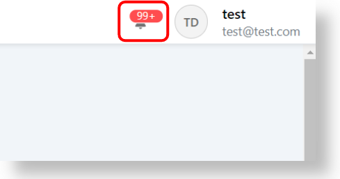
*Figure ********4.8****.********2****: Button to navigate to user notifications section*

The main page of notifications section is represented by the list of all notifications for the current user, as shown in *************Figure **4.8**.**3**: User Notifications List*****. From here, the user can perform some basic browsing on the notifications returned, filter them by date or time, change page and choose a different page size.

When it comes to notifications, it is crucial to understand which ones are new and which the user was already aware about: this can be achieved by the *read *option. By default, all new notifications are *unread *and the system highlights them in blue, while the ones that the user has marked as read are plain white. This can be achieved by the “read notification” button each entry of the list is provided with the following screen

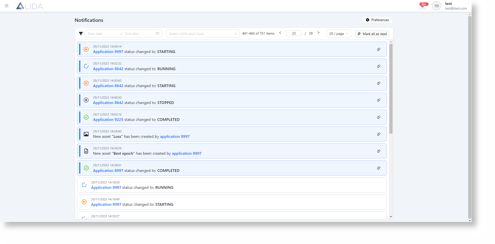
*Figure ********4.8****.********3****: User **Notifications** List*

to mark one notification at a time, or by the handy shortcut “Mark all as read” button, placed on the far right among the toolbar items.

Notification Preferences
Users are also provided with an extensive section where they can deeply customise notification settings. It is accessible through a button on the top right of the notifications list page.

User preferences are divided into *three main categories*:

**Web Preferences **- related to the alerts the users can receive on their browser while using the web application.
**Feed Preferences **- related to the alerts the user set on different means of communication, like emails, instant messaging apps and others.
**Triggers **- related to custom additional logic that can be executed upon receiving notifications under specific circumstances.
*************Figure **4.8**.**4**: User Notifications Preferences******* **shows the page that allows the user to fully personalise the notification settings. First, the user can choose to enable just specific types of notifications. Below this select, settings are divided into three tabs, one for each category.

**Web Preferences **from the Web Preferences tab (*************Figure **4.8**.**5**: Notifications Web Preferences*****) the user can first of all choose to disable all web notifications. When enabled, a list of advanced settings is listed below, divided in groups.

**Applications **- the user can enable or disable notifications related to the BDA Applications execution or they can change the default monitoring behaviour, from getting notifications about the applications the user has executed, to getting all notifications related to the owned applications or a custom setting, where they can choose the specific applications, they want to keep monitoring.

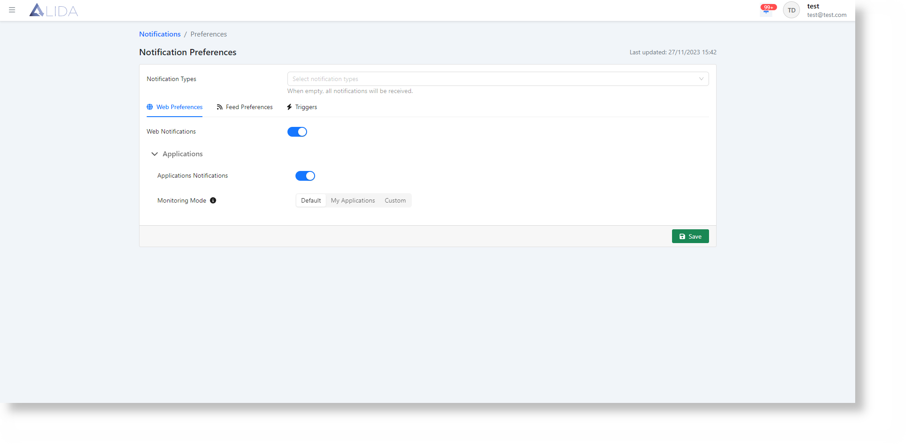
*Figure ********4.8****.********4****: User Notifications Preferences*

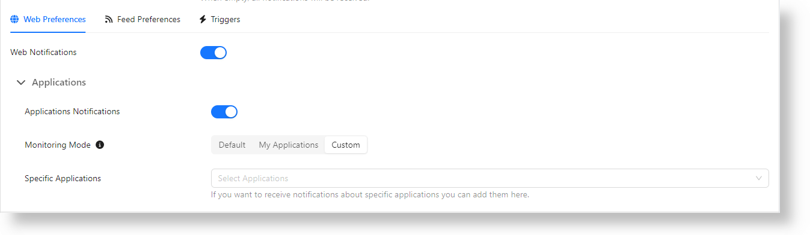
*Figure ********4.8****.********5****: Notifications Web Preferences*

**Feed Preferences **Feed Notifications include all the remaining means of communication with the user from outside of the platform, external channels like emails or third-party messaging apps.

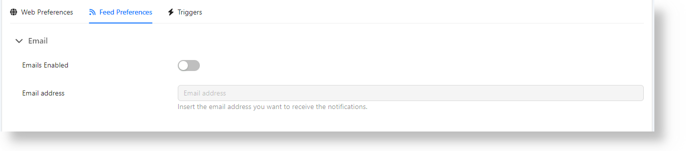
*Figure ********4.8****.********6***: Notifications Feed Preferences

As shown in *************Figure **4.8**.**6*: Notifications Feed Preferences****, settings are grouped based on the technology or communication channel. For each of them, the user can choose to enable or disable the alerts independently or manage the settings peculiar to the underlying technology:

**Email **- provided with the email address to send the notification to;
**Triggers **The term “Trigger” refers to the custom HTTP requests that can be registered to be executed upon receiving of certain notifications based on conditions specified by the user (*****************Figure **4.8**.**8**: New Trigger Modal*****).

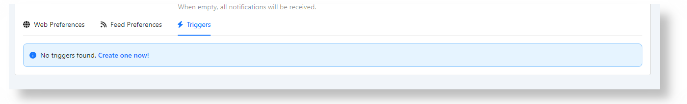
*Figure ********4.8****.********7****: Notifications Trigger*

When adding a new trigger or editing an existing one, a modal opens containing a form asking for all the information about a trigger that’s required for its correct execution.

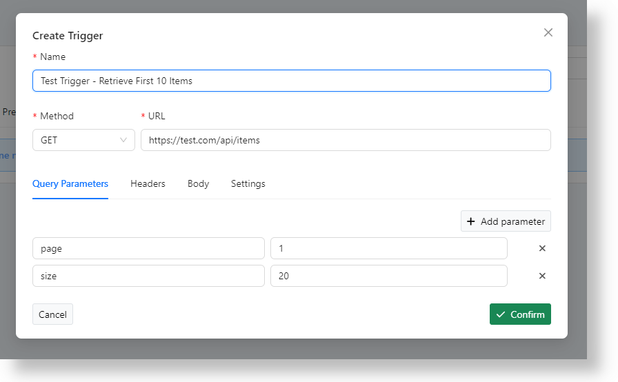
*Figure ********4.8****.********8****: New Trigger Modal*

As *************Figure **4.8**.**8**: New Trigger Modal******* **shows, besides the name, the user is asked to provide all the basic information related to the HTTP call to perform, like the **method **(*GET, POST, PUT, PATCH, DELETE*), the **URL **to send the request to, the optional **query parameters**, additional **headers **and **body**.

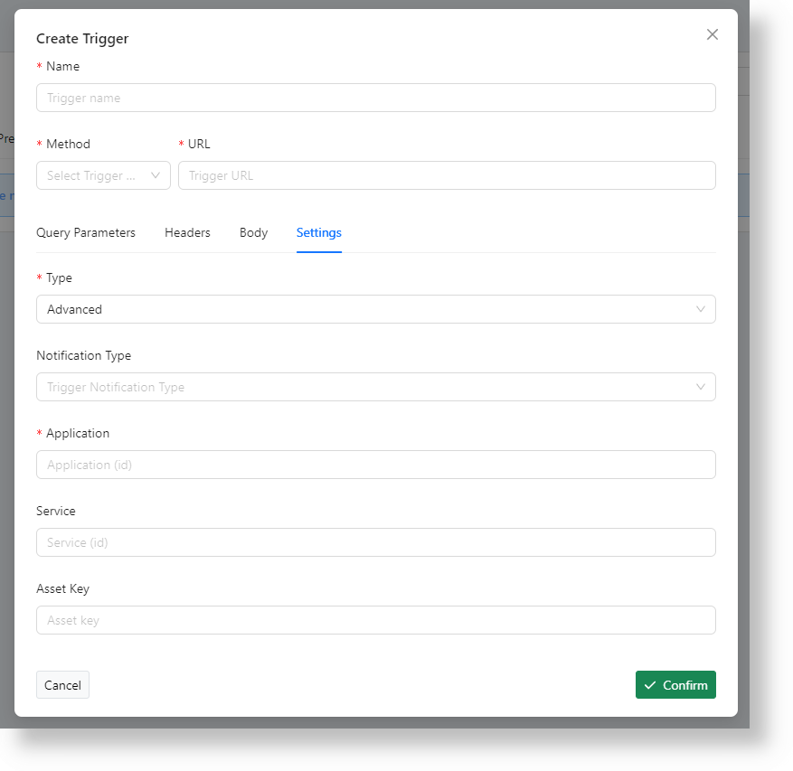
*Figure ********4.8****.********9****: Trigger Advanced Settings*

The last tab of the requested set of information related to a notification trigger contains general settings: the trigger can work based on the *notification type*, meaning that it will be executed every time a specific type of notification is received, or it can have an *advanced *logic, so the user can specify certain conditions for the execution of the HTTP Request, like the **BDA Application**, the **BDA Service **and the **asset key**** **(*Figure **4.8**.**9**: Trigger Advanced Settings*).

DataSource
Register DataSource

To create a BDA, the first step is to connect to a data source. This means we need to identify where the data originates from. On ALIDA, you can connect to various data sources via the “Data Source” menu option. (*************Figure **4.8**.**10**: DataSource Menu*****)

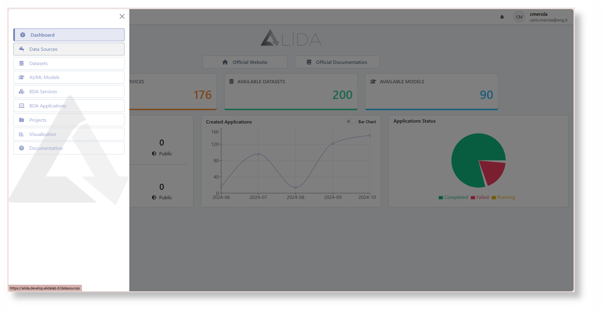
*Figure ********4.8****.********10****: DataSource Menu*

Once inside Data Source menu, you can view the list of available Data Sources shown in the “Data Sources List” which includes sources created by the system or the user over time. New sources can be registered through “***+ Register Data Source***” where you specify the Name, Access Level (whether the item is visible as Private, Team, or Public), and enter a Description field with details on the content of the Data Source. (*************Figure **4.8**.**11**: Register Datasource*****)

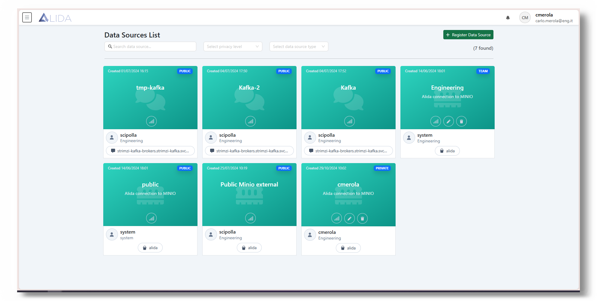
*Figure ********4.8****.********11****: Register Datasource*

It’s essential to specify the Data Source type in the Type field, which could be: Message Broker, useful for streaming flows, or Object Storage, the default ALIDA system, allowing persistence of structured, unstructured, and semi-structured generic data, such as Min.IO. Additional types include Tabular Storage, such as MySQL, and Filesystem Storage, which acts as a typical filesystem. (*************Figure **4.8**.**12**: New DataSource Registration Form*****)

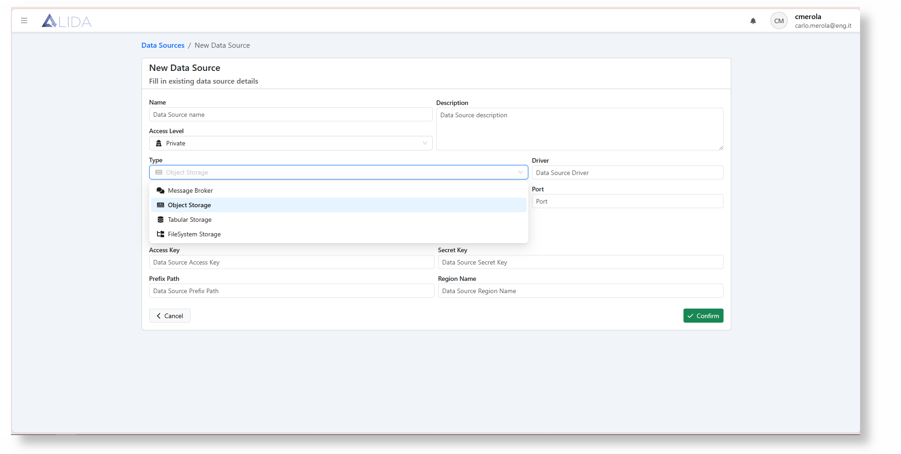
*Figure ********4.8****.********12****: New DataSource Registration Form*

Depending on the Data Source type, different fields need to be specified. For example, Tabular Storage requires fields like Host, Port, Database, User, and Password. Object Storage types might require fields such as Driver, Host, and Bucket Access Key.

There is a predefined list of Data Sources. When a new user is created, ALIDA automatically creates Min.IO spaces: one private, one team-based, and a public space for all users. A message broker, KAFKA, is available on all ALIDA instances for potential use in streaming flows.

The page contains all connectors to data storage, which may be internal (as in the example screen) or created by the user to connect to external storage.

As you can see, we’re not yet dealing with Datasets but rather defining a source where data can be stored. Only after defining the data source can a Dataset be created.

Datasets
Create Dataset
The dataset is a representation in the form of metadata for a specific datasource. To proceed with creating a dataset, select the “***+ Register Dataset***” option. You can find it upper right into Dataset menu. (*************Figure **4.8**.**13**: Register Dataset*****)

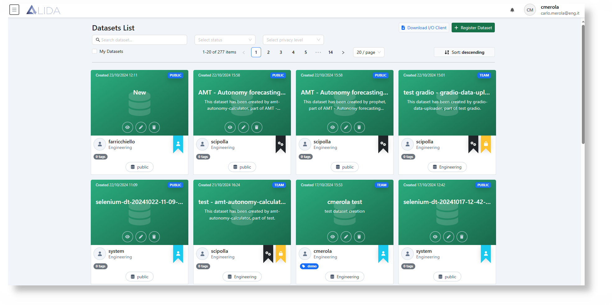
*Figure ********4.8****.********13****: Register Dataset*

In the screen that appears, you can choose the Data Source referring to. Once the Data Source is selected, choose the desired directory and enter a description and tags. If the Data Source is of a tabular type, you can view the table schema with the related fields, which can be edited. (*************Figure **4.8**.**14**: New Dataset Filling Details*****)

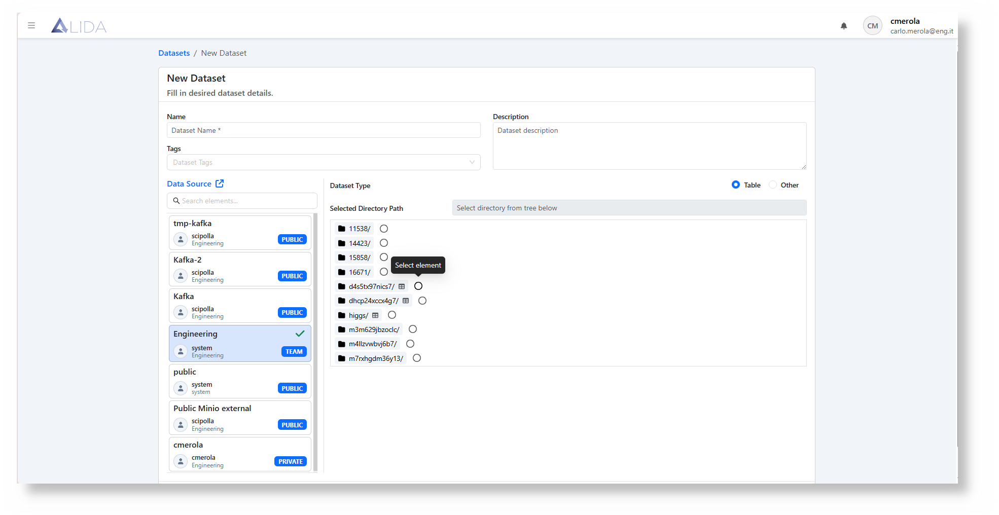
*Figure ********4.8****.********14****: New Dataset Filling Details*

You can then save and access the creation report screen for the new dataset, with a toast message displaying “*Dataset registered successfully*,” (*************Figure **4.8**.**15**: Dataset Registered Successfully*****) from which you can view a Dataset Preview for potential modifications.

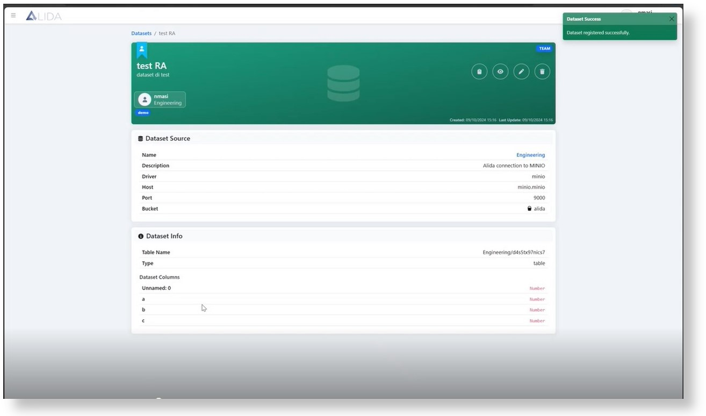
*Figure ********4.8****.********15****: Dataset Registered Successfully*

Dataset Handling
In the Datasets List, (*************Figure **4.8**.**16**: Dataset List*****) you can also recognize if the dataset was created by a user, indicated by a blue ribbon displaying the text “*This has been created by user*” If the dataset is generated by a BDA flow, it is marked by a black ribbon with the text “*This is an output from an execution*”

After this, the new dataset will appear in the updated Datasets List.

Another element can be associated with the result of the previous process, marked with a yellow ribbon and the label “*This has not been created yet*” This occurs when the application has not yet been executed with the RUN of the BDA application.

As you access the details of a single Dataset, the following actions are available: copy to clipboard, preview, edit, and delete.

**Copy to clipboard **- copies the structure of the Dataset in JSON format.
**Preview **- displays the data contained within the Dataset.
**Edit **- allows modification of the Dataset structure.
**Delete **- allows for deletion of the Dataset.
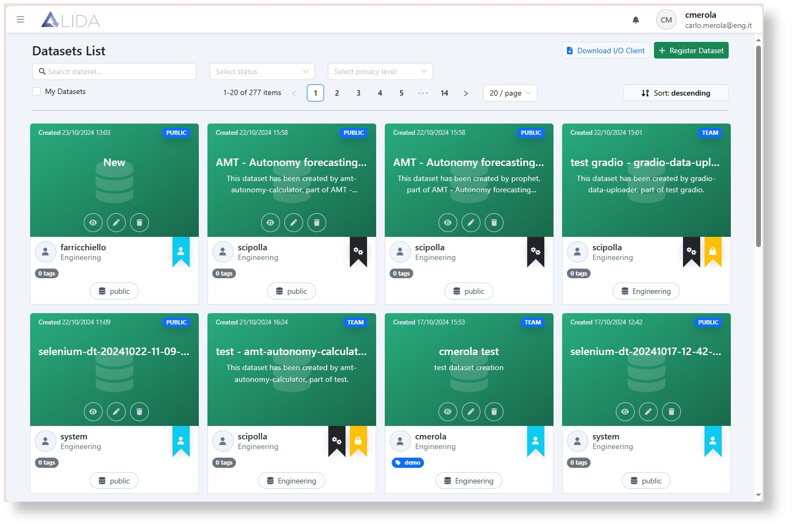
*Figure ********4.8****.********16****: Dataset List*

BDA Services
BDA Services are microservices capable of processing Big Data and handling both BATCH and STREAM data flows. (*************Figure **4.8**.**17**: Service List*****)

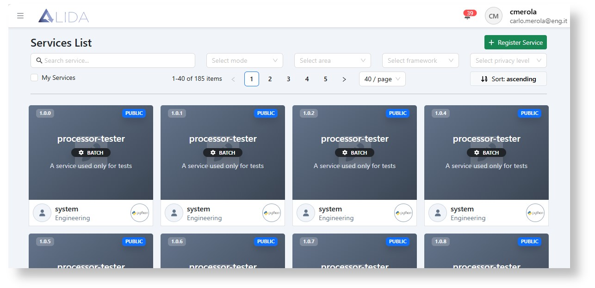
*Figure ********4.8****.********17****: Service List*

The creation of these BDA services requires varying timeframes.

Our ALIDA catalogue includes a range of BDA services categorized by area: ingestion, preparation, processing, analysis, visualization, evaluation, FML (Federated

Machine Learning) aggregator, and FML participant. (*************Figure **4.8**.**18**: Create New Service*****)

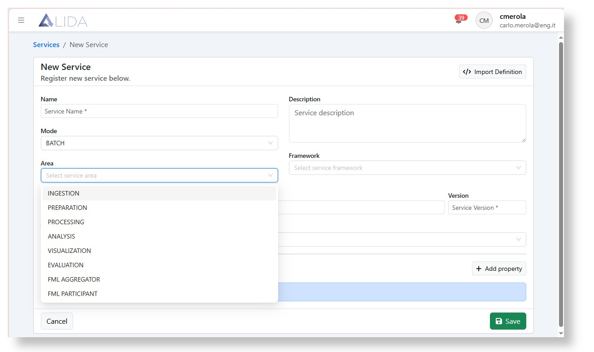
*Figure ********4.8****.********18****: Create New Service*

Within a BDA service, there is a set of properties that are useful during the design phase.

A BDA service, as exemplified in this case (kmeans-fit-elbow-method), was created using SPARK, a software employed on ALIDA to scale computation. In this instance, the scaling is achieved horizontally across multiple nodes.

Thanks to this microservice utilizing SPARK, it is theoretically possible to work with Big Data. The parameters shown in the example are all properties defined by the creator of the BDA service. (*************Figure **4.8**.**19**: Kmeans Service Sample*****)

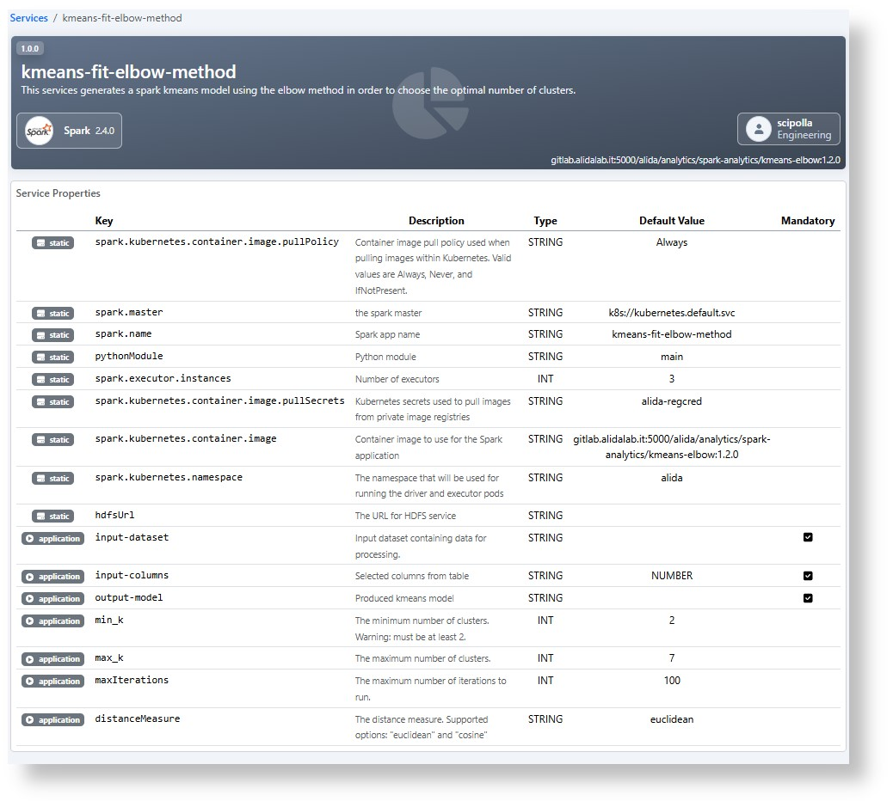
*Figure ********4.8****.********19****: Kmeans Service Sample*

All BDA services are microservices built as Docker images.

(e.g.,

*gitlab.alidalab.it:5000/alida/analytics/spark-analytics/kmeans-elbow:1.2.0*)

Meanwhile, the Keys list all the properties used during the runtime of the BDA service.

BDA Services Creation
To proceed with the creation of a BDA Service, log in to the ALIDA platform and select **BDA Service **from the menu in the top-left corner.

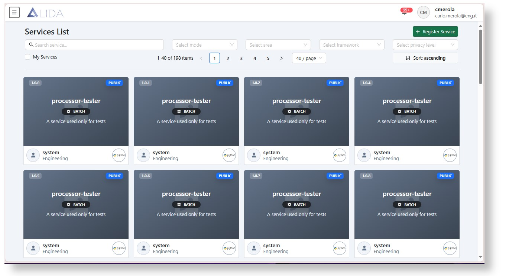
*Figure ********4.8****.********20****: BDA Service Creation*

A list of Services will appear, and in the top-right corner, you’ll find the **+Register Service **button. (*************Figure **4.8**.**20**: BDA Service Creation*****)

By clicking this button opens the **New Service - Register new service below **screen, which displays input fields, some of which are mandatory.

Alternatively, you can create a service by selecting **Import Definition**, where instead of entering each field manually, you can import a JSON file in textual format containing the required fields for the service’s creation.

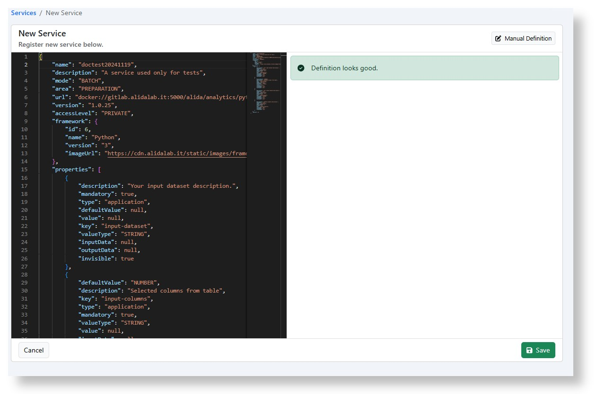
*Figure ********4.8****.********21****: BDA Service - Import Definition*

This interface validates the syntax of the pasted JSON. If the validation check returns the message **Definition looks good.**, the JSON is validated, and you can proceed by clicking **Save **to register the service as defined. (*************Figure **4.8**.**21**: BDA Service - Import Definition*****)

Finally, the service properties screen will appear, and you can verify the newly created service in ALIDA’s list of services.

BDA Application
The BDA App is the component that allows us to define our logic for analytics.

BDA Application Creation
To create a BDA Application, navigate to the **BDA Application **menu and select **+Create Application**.

You can configure the access level and consequentially, the default data source available.

For example, if we want to create an application with a defined access level (e.g., *team*), which will then display the loaded data sources associated with the corresponding access level, such as *Engineering *in this example.

Alternatively, if the access level *Public *were selected, all data sources associated with that access level would be available for selection.

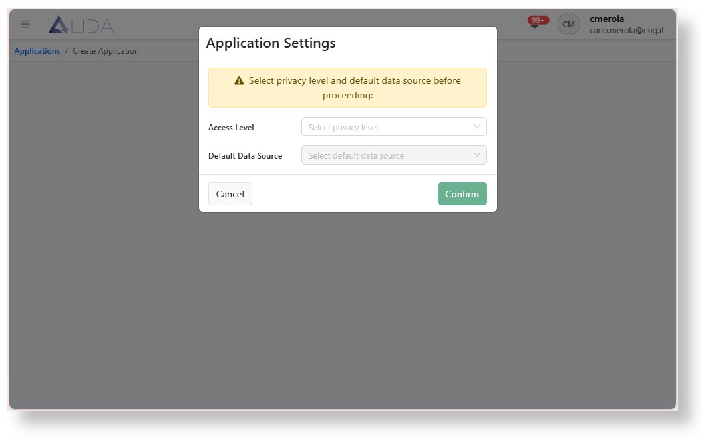
*Figure ********4.8****.********22****: BDA Application Creation*

By selecting the *Confirm *button, a dashboard appears displaying all the available elements, including services, datasets, and models, for creating the BDA application.

If we want to add a dataset, we can select one from the list available in the left-hand panel. For instance, we look for a test dataset, such as the one named *IRIS*.

Next step, we select which service to associate with this dataset by choosing from the service categories such as *preparation*, *analysis*, or *fml_aggregator*. (*************Figure **4.8**.**23**: BDA App Creation 01*****)

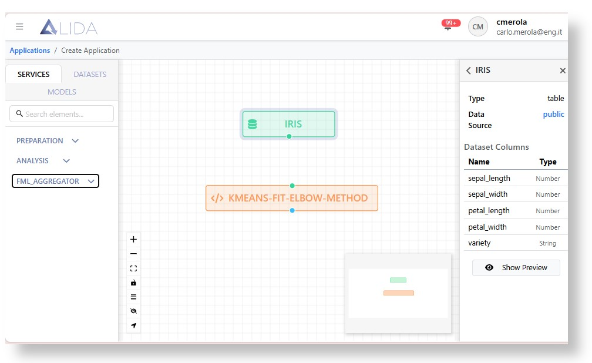
*Figure ********4.8****.********23****: BDA App Creation 01*

Once the dataset is selected, it provides information about the name and type of its fields.

Additionally, it is possible to preview the dataset, which is displayed in a table format.

So, we link the *IRIS *dataset as the input to the *KMEANS *BDA service. This operation is facilitated by the system, which indicates the connection with *green dots*.

Next, we proceed to select from the models panel, which is represented by the *blue dot*.

It is straightforward to understand that the output generated by the BDA service will serve as the input to the chosen ML model.

In this example, we use a *kmeans *service to train a model based on a specific dataset (*IRIS*). Once the dataset is selected, it provides information about the name and type of its fields. Additionally, it is possible to preview the dataset, which is displayed in a table format.

Within the chosen BDA service, it is also possible to define various parameters, such as *maxIteration *or the *Maximum number of clusters *and *Minimum number of clusters *to display in the distribution. (*************Figure **4.8**.**24**: BDA App Creation 02*****)

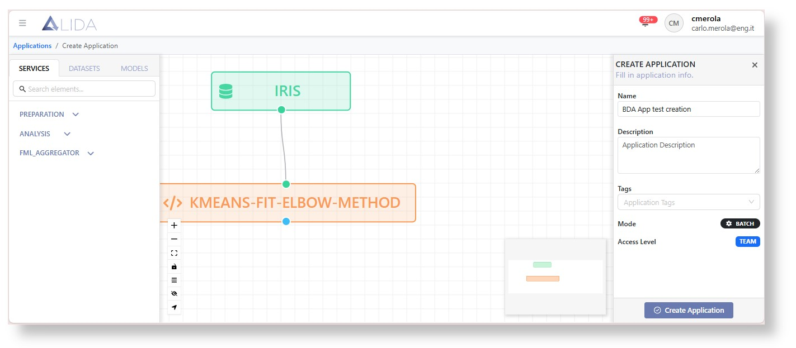
*Figure ********4.8****.********24****: BDA App Creation 02*

The combination of elements can also be multi-layered, meaning that the output of one model can serve as the input for another BDA service, such as a prediction service.

Once you consider the configuration as completed, you need to fill in the *Name *and *Description *fields and click *Create Application *to create your BDA App.

BDA Application Modify
Once the BDA App is created, you can check its presence in the Application List.

The card provides several details, including the Name, the creator, the workflow schema, the BDA state (first state is READY), the list of Application Media it represents, any transitional data with output elements viewable even before the batch process is complete, and the BDA version, which changes if it is edited and modified.

Once the BDA App is created, you can check its presence in the Application List. The card provides several details, including the Name, the creator, the workflow schema, the BDA state (first state is READY), the list of Application Media it represents, any transitional data with output elements viewable even before the batch process is complete, and the BDA version, which changes if it is edited and modified.

For this BDA, there is still the option to delete it, export it using EXPORT, or, in the case of standalone operation, run it as a DOCKER COMPOSE outside the ALIDA cluster. This is achieved by generating a .zip file containing a .yml Docker file with the characteristics of the created BDA App. (*************Figure **4.8**.**25**: BDA Application Feature*****)

In this case, it is crucial to consider both the specifications of the machine running DOCKER and the accessibility of the data being used.

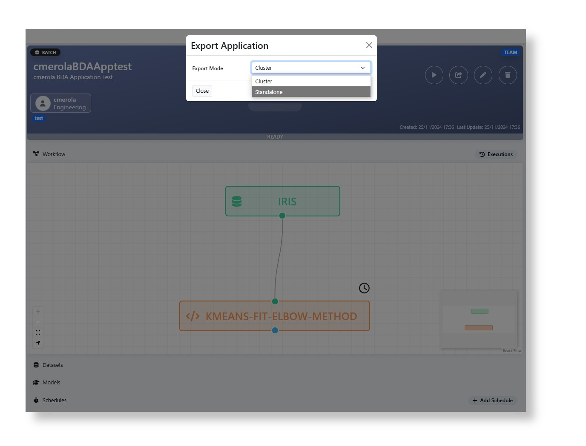
*Figure ********4.8****.********25****: BDA Application Feature*

BDA Application Run
Once the BDA App has been configured and created, it can either be RUN or scheduled for execution.

Due to resource distribution, it is not possible to estimate the execution time of a BDA App, as it needs to gather both data and services from various Docker images.

Notifications can be received during the RUN of a BDA App; however, this feature is not available for all BDA Apps.

As an example, we examine the BDA App called *Adaboost Nocc*.

From this, we can observe not only the multiple versions created during testing but also, once the app reaches the **COMPLETED **state, the ability to view *Application** **Media*. (*************Figure **4.8**.**26**: Application Media Sample*****)

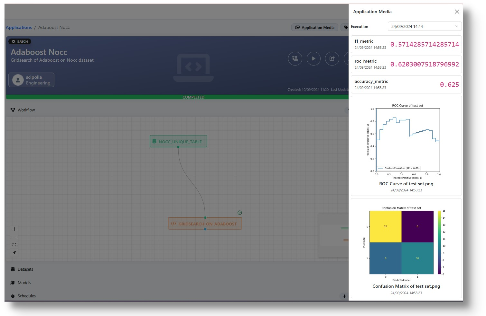
*Figure ********4.8****.********26****: Application Media Sample*

These include additional elements such as *f1_metric*, *roc_metric*, and *accuracy_metric*, as well as visualizations like *ROC Curve of test set.png *or *Confusion Matrix of test set.png*.’

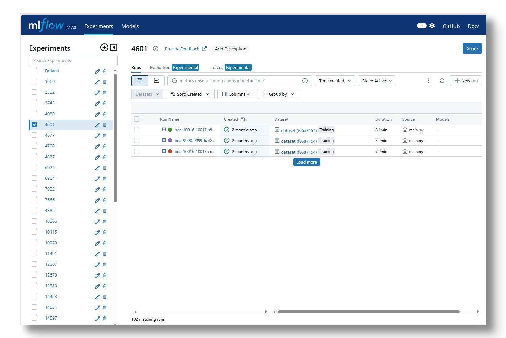
*Figure ********4.8****.********27****: MLflow Tool*

If the trained model within the BDA App is of the FML type, it is possible to perform a comparison using the *Experiments *button, which provides access to the *mlflow *tool. (*************Figure **4.8**.**27**: MLflow Tool**********************Figure **4.8**.**27**: MLflow Tool*****)

Machine Learning
Regression
Time Series Analysis
Deep Learning (Deep Neural Nets)
Reinforcement Learning
5.185.18Self-Supervised LearningSelf-Supervised LearningClassification and Regression Trees
Further Rule Induction Techniques
Support Vector Machines
Instance-Based Approaches
Bayesian Modeling
Transfer Learning
Ensembles and Hierarchical Models
Recommendation Techniques
Measures of Fit
Testing of Predictive Models
CNN, RNN, GNN
Generative Adversarial Networks (GAN)
Federated Learning

Other Advanced Analytics
Solver approaches
Heuristic approaches
Design of experiments
Discrete Events
Monte Carlo Simulation
Agent-Based Modelling
Text Analytics
Customizable Pretrained Algorithms
Audio Mining
Image Analytics
Geospatial Analysis
Financial Modelling and Econometrics
Decision Modelling
Decision Management
Composite AI
Stream Processing/Data in Motion

Flexibility, Extensibility and Openness
R
Python
Scala
Java
Third-Party Libraries
Popular Libraries and Frameworks
Data Science Notebooks
Read datasets inside Notebooks
To read a dataset registered in ALIDA inside a Notebook you can copy the dataset metadata from ALIDA UI through the button highlighted below:

Then use the following code inside the notebook. Remember to paste the copied json (make it one liner) where it says: <here-paste-json-metadata-of-dataset>.

# Install requirements

!pip install alida-notebook-utils

import json

from alidanotebookutils.pandasAssets import load_as_pandas_dataframe os.environ['GET_PROPERTIES_FROM_ENV'] = "true"

# Read dataset

df = load_as_pandas_dataframe(raw_data=json.loads (<here-paste-json-metadata-of-dataset>)) print(df.sample)

Figure 3.7.1:Read DatasetFigure 3.7.1:Read Dataset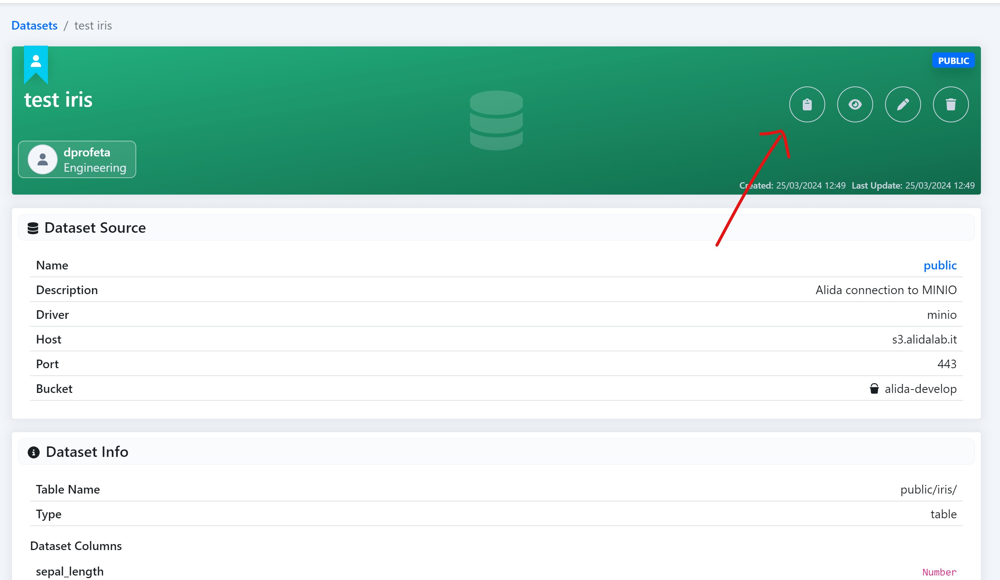

Open-Source Data Management Platforms (e.g., Spark and Hadoop)
Docker
Scripting and Embedding Capabilities
Open-Source Automated Machine Learning Tools
Code Visibility and Transparency

Performance and Scalability
In-Database Analytics
Big Data Volume Scalability
Real-Time Data and Streams
In-Memory, Hadoop and Spark
Support of GPUs
Support of Other Specialized Hardware
Algorithmic Efficiency in a Single-Node or MultipleNode Environment
Cost guidance
Performance options for training
On-Premises
Cloud, Hybrid and Multicloud

Delivery
Write-back
Recoding
REST APIs
PMML and ONNX
Augmented Model Deployment and Monitoring
Containerization
Web deployment
Other
Deployment Mode
In this section, we will explain the process of deploying a model, turning your work into a service accessible via a REST API. This way will allow to easily integrate the prediction of your model within different applications and systems.

Model Serving
To deploy a model through ALIDA UI, you need to create an AI/ML model using ALIDA’s dedicated section. Once the model reaches the “completed” status without any errors, navigate to the model details page and click the play button located in the top right corner of the header.

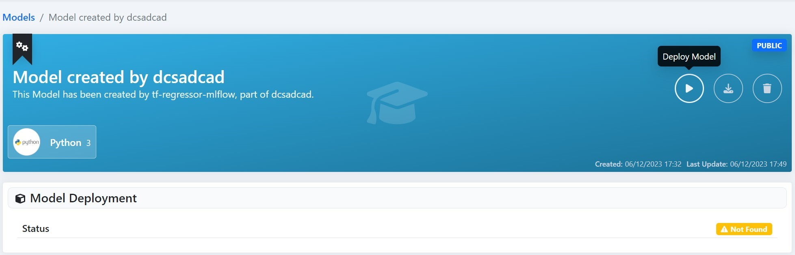
Upon clicking, ALIDA will display a panel for configuring deployment settings as follow:

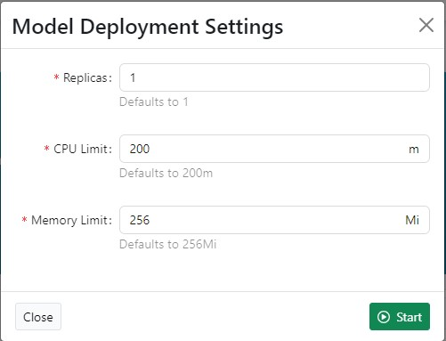
Replicas: Specify the number of copies to be deployed in the cluster.
CPU Limit: Set a limit on CPU consumption to prevent resource saturation.
Memory Limit: Define a limit on memory consumption to prevent resourcesaturation.
Upon clicking the Start button in this window, a pop-up message will appear, indicating the successful deployment of the model. Subsequently, the Model Deployment section will provide detailed information about the deploying model. Once the status transitions from toto, the service is fully operational and ready to be utilised for making predictions with the URL provided within the Model Deployment Section.

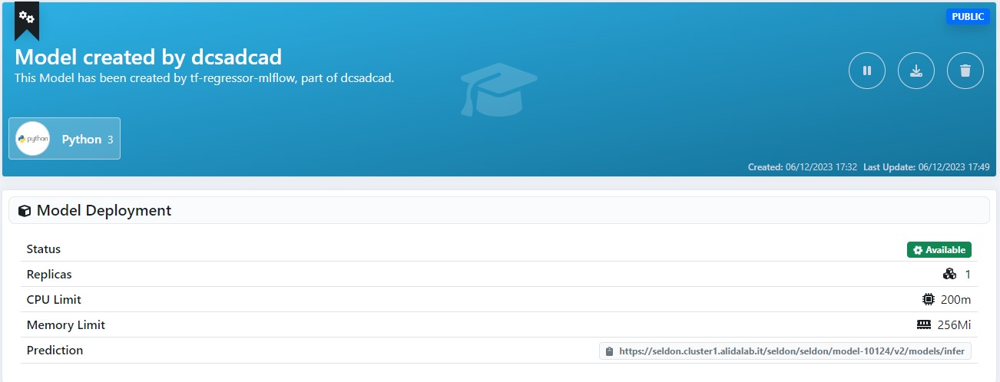
The deployed model is now prepared to receive prediction requests through the provided URL. If it becomes unnecessary, you have the option to halt the deployment by using the Pause button located in the top right corner.

Parallel Model Deployments

Platform and Project Management
Compliance and Auditing
Object Reuse
Multiuser Capabilities
Debugging and Unit Testing
Runtime Optimization
Audit and Logs
Data Encryption
Securing ML Pipeline
Client Deployment

Model Management
Metadata management
Traceability
Champion/Challenger
Model Telemetry
Confusion Matrices
Model Catalog and Reproducibility
Technical Performance Tracking
Business Performance Tracking
Adaptive ML
Model Alignment to Business Ojectives
Governance
Model Licensing Issues
Scripting and Automation
Process Monitoring
Model Management Across Deployment Modes

MLOps
Intro
### **N.B. Bisogna capire se fare una sezione specifica per MLOps, oppure rispondere in maniera puntuale nelle sezioni ”Performance and Scalability”, ”Delivery” e ”Model Management” le cui innovazioni sono per Gartner il concetto di MLOps.**

In this section we will introduce how ALIDA supports a machine learning model life cycle.

Model life cycle
**Questa sottosezione va spostata perché non spiega all’utente come sfruttare Alida per fare qualcosa, bensì tratta teoria generica. **ML model life cycle involves a series of interconnected stages aimed at developing, deploying, and maintaining machine learning models in a systematic and efficient manner. This life cycle typically consists of the following key phases:

Problem Definition and Planning:
In this initial phase, the business problem or opportunity is defined, andthe goals for the machine learning project are established.
Project stakeholders collaborate to set expectations, identify success cri-teria, and allocate resources.
Data Collection and Preprocessing:
Relevant data is collected and prepared for model training. This involvestasks such as data cleaning, feature engineering, and handling missing values.
Data quality and integrity are crucial, as they directly impact the per-formance and reliability of the machine learning model.
Model Development:
Data scientists and machine learning engineers create and train modelsusing various algorithms and techniques.
This phase involves experimenting with different models, fine-tuning pa-rameters, and evaluating performance metrics to select the most effective model for the given task.
Model Testing and Validation:
Models are tested on independent datasets to assess their generalisationcapabilities and ensure they perform well on unseen data.
Validation is a critical step to detect issues such as overfitting and tofine-tune the model for optimal performance.
Model Deployment:
The selected model is deployed to production or staging environments,making it accessible for integration into applications or business processes.
MLOps tools, like MLFLOW or SELDON, play a crucial role in automat-ing and managing the deployment process, ensuring reproducibility and consistency.
Monitoring and Maintenance:
Once deployed, models need continuous monitoring to ensure they per-form as expected in real-world conditions.
MLOps tools facilitate monitoring of model health, tracking performancemetrics, and triggering alerts for potential issues.
Model Updates and Iterations:
As new data becomes available or business requirements change, modelsmay need to be updated or retrained.
MLOps practices support automated pipelines for model updates, ensur-ing a seamless integration of new versions without disrupting ongoing operations.
Retirement or Replacement:
Models that no longer meet performance criteria or are no longer relevantto business objectives may be retired or replaced with more advanced versions.
MLOps provides frameworks for graceful model retirement and replace-ment processes.
In the next sections, each of this steps will be described, except for the first one, since it is outside the scope of ALIDA.

Data collection and preprocessing
## **Questo va nella famiglia ”Data Access” **

Data collection in ALIDA happens in two ways:

Using the ALIDA IO Client, a small application that allows to download andupload datasets of undefined dimension (up to the tests done so far, it is possible to upload any size of dataset).
Using a streaming BDA app with sink services saving inside ALIDA storages.Preprocessing happens within workflows using preprocessing service blocks, or can be done inside a Jupyter notebook (an instance of Jupyter hub is deployed with ALIDA).
Model Development, testing and validation
### **Se qui l’intenzione era descrivere la presenza del workflow builder grafico, quella descrizione andrebbe sotto la sezione ”Visual Pipelining or Visual Composition Framework”. Altre questioni, inerenti MLFLOW vanno piazzate altrove, cercando di capire di cosa si vuole parlare, quale feature si vuole descrivere.**

**Model development **is the main job of analytics workflows. This can be done using the services available inside ALIDA or developing new ones starting from available templates (advised), or from scratches to address specific needs. Regarding fine **tuning **of hyper-parameters we added support for ML-Flow framework. Each instance of ALIDA comes with ML-Flow. Inside the page of a BDA app you can click to the experiment icon and you will be redirected to ML-Flow (check official Ml-Flow doc for more information). This is only supported with services developed specifically for ML-Flow. Testing and validation can be done also by using BDA apps and more specifically using evaluation services.

Model Deployment
### **Anche queste sottosezioni andrebbero spostate, presumibilmente sotto quella di ”Delivery”.**

Currently there are two ways of serving a model:

Using the play button on the model page (works only for MLFLow wrappedmodels and Tensorflow Serving compatible model). Those models will be served with Seldon Core on the backend. It is also possible to specify resources dedicated to the model serving, such as amount of replicas and reserved CPU percentage.
Using MLFlow generic predict service, that reads model from MLflow andserve them inside a BDA app. BDAs can be then exported and work on the edge.
Monitoring and Maintenance
Models can be monitored using frameworks such as Evidently wrapped in BDA services.

Explainable AI
Explainable AI
Support for Open Source
Augmented Explainability
Explainabiliity Techniques (Including Permutation Importance, Feature Importance, Sensitivity Analysis, Partial Dependence Plots, ICE Plots, Integrated Gradients, Similarity Based Methods and Others)
Responsible AI
Regulations

Precanned Solutions
Marketing, Sales and Customer Service
Finance, Risk Management and Quality Management
Internet of Things
Supply Chain/Logistics
Back-Office Analytics
IT Operations
Cybersecurity
Anomaly Detection
What-If Scenarios

Collaboration
Collaboration Across All Modeling Steps for Distributed Teams
Discussion Threads
Ratings and Recommendations
Marketplace/Hub
Multipersona Collaboration

Part III

R&I Guide

Data Access
Enterprise Application Integration
Data Replication and Synchronization
Basic and Advanced ETL Functionality
Hybrid and Multicloud Data Sources
Access to Non-traditional Data Types
Connectivity to Data Lake Infrastructure
Data Lineage
Data Governance and Metadata Management
API-Based Access to Web Data

Data Preparation
Data Blending/Wrangling
Data Augmentation
Data Quality Support
Dataset Partitioning
Binning and Smoothing
Filter and Search
Feature Generation
Official Watermarking of Datasets
Basic Data Catalog
Data Labeling/Annotation
Transformations, Aggregation and Set Operations
Data Enrichment
Augmented Data Preprocessing
Augmented Data Preparation
Cloud, Hybrid and Multicloud Support

Data Exploration and Visualisation
Univariate and Bivariate Statistics
Statistical Significance Testing
Signal Preprocessing
Data Visualizations
Exporting Results
Custom Visualization
Clustering and Self-Organizing Maps
Geolocation Mapping
Affinity and Graph Analysis
Conjoint and Survey Analysis
Density Estimation
Similarity Metrics
Augmented Data Discovery
On-Premises
Cloud, Multicloud and Hybrid
## ****

User Interface
Ease of Use and Learning Curve
Developer-Focused Data Science
NLP Q&A
Documentation
User Community
Third-Party Applications
Visual Pipelining or Visual Composition Framework
Wizards and Contextual Aids

Machine Learning
Regression
Time Series Analysis
5.3Deep Learning (Deep Neural Nets) 5.4Reinforcement Learning
5.185.18Self-Supervised LearningSelf-Supervised LearningClassification and Regression Trees
Further Rule Induction Techniques
Support Vector Machines
Instance-Based Approaches
Bayesian Modeling
Transfer Learning
Ensembles and Hierarchical Models
Recommendation Techniques
Measures of Fit
Testing of Predictive Models
CNN, RNN, GNN
Generative Adversarial Networks (GAN)
Federated Learning

Other Advanced Analytics
Solver approaches
Heuristic approaches
Design of experiments
Discrete Events
Monte Carlo Simulation
Agent-Based Modeling
Text Analytics
Customizable Pretrained Algorithms
Audio Mining
Image Analytics
Geospatial Analysis
Financial Modeling and Econometrics
Decision Modelling
Decision Management
Composite AI
Stream Processing/Data in Motion

Flexibility, Estensibility and Openness
R
Python
Scala
Java
Third-Party Libraries
Popular Libraries and Frameworks
Data Science Notebooks
Intro
### **Questa sottosezione va spostata perché non spiega all’utente come sfruttare Alida per fare qualcosa, bensì tratta teoria generica.**

Integrating a big data machine learning platform with python notebooks (e.g., Jupyter Notebook) can offer several advantages for data scientists, engineers, and researchers working with large datasets and complex machine learning tasks. Here are some reasons why such integration might be beneficial:

Interactive Data Exploration: python notebooks provide an interactive and user-friendly environment for data exploration. Data scientists can load, visualise, and manipulate large datasets easily, which is crucial for understanding the data before building machine learning models.
Collaboration: notebooks are often coupled with multi-user servers allowing multiple users to collaborate on the same platform. This is especially useful in a team or educational setting, where data scientists and analysts can work together on big data projects, share insights, and collaborate on code.
Reproducibility: notebooks help in documenting the entire data analysis and machine learning process. Users can keep track of code, comments, and visualisations, making it easier to reproduce results, troubleshoot issues, and share findings with others.
Flexibility: Big data machine learning platforms are often complex, requiring advanced configuration and code development. Notebooks offer flexibility by allowing users to write code in a more user-friendly and modular way, which can be especially helpful for prototyping and experimentation.
Access to Big Data Tools: Big data platforms often come with a variety of tools for distributed data processing, such as Apache Spark and Hadoop. Integrating these tools with notebooks allows data scientists to work with large datasets and leverage distributed computing without leaving the familiar notebook environment.
Visualisations: Notebooks support a wide range of data visualisation libraries.This makes it easy to create interactive visualisations of big data, helping data scientists explore patterns and trends in the data without the complexity of developing BDA services before having a clear picture in mind.
Documentation: Data scientists can use notebooks to document their workin a narrative format, combining code, visualisations, and explanations. This aids in knowledge sharing, on-boarding new team members, and ensuring that the work is well-documented.
Parallel Computing: Notebook servers can be configured to run notebooks onclusters, which is especially beneficial for handling big data tasks. Users can leverage parallel computing and distributed resources to speed up calculations.
Ease of Deployment: Notebooks can be set up to run on cloud-based infras-tructure, making it easier for organisations to scale their big data machine learning projects and access computing resources on-demand.
Technologies involved
Nowadays multiple technologies allow the use of code notebooks. Jupyter notebooks is probably the most popular choice, however other notebook technologies, such as R Markdown, Zeppelin, and Databricks notebooks, have their own strengths. The choice between notebook technologies should be based on factors like the programming language needed and specific use cases. A more extensive list of notebook enabling technologies can be found at [this link](https://landscape.lfai.foundation/card-mode?category=notebook-environment&grouping=category).

Being the most popular and allowing so far all the desired features for ALIDA, Jupyter notebook has been chosen. Moreover, as it happens on BDA services, it can be used in conjuction with pyspark, allowing big data analytics.

Jupyter Notebooks
Jupyter notebooks, often referred to simply as ”notebooks,” are interactive computing documents that allow you to create and share code, visualizations, and narrative text. They are widely used in data science, scientific research, and education for

tasks like data analysis, data visualization, machine learning, and more. Jupyter notebooks have become particularly popular in the Python programming community, although they support multiple programming languages.

Here are some key characteristics and components of Jupyter notebooks:

Cells: Notebooks are composed of cells, which are individual units that cancontain code, text, or other content. There are two primary types of cells:
Code Cells: These cells contain executable code. You can write code inlanguages like Python, R, Julia, and others. When you run a code cell, it executes the code and displays the output right below the cell.
Markdown Cells: These cells contain narrative text written in Markdownformat. You can use them to provide explanations, documentation, and annotations for your code and results.
Interactive Execution: One of the main advantages of Jupyter notebooks istheir interactive nature. You can run code cells one by one, allowing you to see the immediate results of your code. This interactivity is beneficial for data exploration, experimentation, and step-by-step code development.
Rich Output: Jupyter notebooks support a wide range of rich media outputs,including tables, charts, images, and interactive visualizations. This makes them an excellent tool for data visualization and storytelling.
Mixing Code and Text: Jupyter notebooks enable you to combine code andtext, providing a means for documenting and explaining your work. This is especially useful for creating reproducible research reports or educational materials.
Kernel: Each notebook is associated with a computational kernel, which isresponsible for executing the code in the notebook. You can use different kernels for different programming languages.
Exporting and Sharing: Jupyter notebooks can be exported to various formats,such as PDF, HTML, Markdown, and more. This makes it easy to share your work with others. Notebooks can also be shared online through platforms like GitHub, JupyterHub, or cloud-based services like Google Colab.
Extensions and Plugins: Jupyter notebooks can be extended with variousplugins and extensions that add functionality and improve the user experience. For example, JupyterLab is a more advanced interface built on top of Jupyter notebooks with additional features and plugins.
Version Control: Notebooks can be managed with version control systems likeGit, allowing you to track changes over time and collaborate with others on the same notebook.
Jupyter notebooks have gained popularity in the data science and research communities due to their versatility and ability to document, share, and reproduce computational workflows. They provide an interactive and user-friendly environment for data analysis and experimentation.

Jupyter Hub
JupyterHub is a multi-user web application that allows users to create and manage Jupyter notebooks on a shared server. Jupyter notebooks are interactive computing environments that enable users to write and execute code, display visualizations, and document their work in a combination of code, text, and multimedia content. Here are some key features and aspects of JupyterHub:

Multi-User Support: JupyterHub is designed for multi-user environments suchas classrooms, research groups, or organizations. It enables multiple users to access Jupyter notebooks on a shared server, each with their own isolated environments.
Web-Based Interface: Users access JupyterHub through a web browser, making it accessible from various devices and platforms. They can create, edit, and run Jupyter notebooks from this interface.
User Authentication: JupyterHub supports various authentication mechanisms, allowing administrators to control who can access the system. Common methods include integrating with LDAP, OAuth, or other identity providers.
Isolation and Scalability: JupyterHub provides isolated environments for eachuser, which means that users can install their own libraries and packages without affecting others. It can also be configured to scale horizontally to accommodate a large number of users.
Customization: JupyterHub can be customized to meet the specific needs ofan organization or educational institution. You can configure it to launch notebooks with different programming languages, specify resource limits, and create custom landing pages.
Integration with Spawners: JupyterHub uses spawners to launch user notebooks. A spawner is responsible for starting and managing the notebook servers. JupyterHub supports various spawners, including local spawner (for running on the same server), Docker spawner, Kubernetes spawner and more.
Resource Management: JupyterHub can manage resources like CPU and memory to ensure that users get a fair share of the available resources.
Community and Ecosystem: JupyterHub is part of the Jupyter Project, whichincludes a rich ecosystem of tools and libraries for interactive computing, data analysis, and scientific computing. It is widely used in educational settings and data science workflows.
Data access
Besides notebook enabling technologies, other instruments are needed. A user should in fact be able to load ALIDA produced or registered models and datasets. To this aim many possibilities are available, ranging from a python library allowing to load them, to more complex solutions.

**Python library **A Python library that enables users to download datasets from a big data and machine learning platform into notebooks could provide a convenient and programmatic way to access and retrieve data from the platform’s repositories.

This library’s aim would be to simplify the process of acquiring, importing, and working with data by providing easy-to-use functions.

Moreover, code could be generated inside the platform, allowing even easier use of it inside notebooks.

**POSIX-compliant file systems **Distributed and scalable POSIX-compliant file systems could be used to access files directly as a developer would do on his local machine, without knowing much aboud ALIDA inner workings and data management.

Basically this would involve reading datasets from the simulated file system. Let’s break down what are the carateristics of these systems:

Distributed File System: A distributed file system is a file system that spansmultiple storage servers or nodes. It allows users to store and retrieve files on a network of interconnected machines. This distribution can improve data availability, fault tolerance, and data access speed.
Scalability: Scalability in this context refers to the ability of the file systemto handle a growing amount of data, users, or workloads. It should be able to scale horizontally (by adding more servers) to accommodate increased storage and data processing needs.
POSIX Compliance: POSIX is a set of standards that define the behavior ofoperating systems and file systems. A POSIX-compliant file system adheres to these standards, ensuring that it provides a familiar and consistent interface for working with files and directories. POSIX compliance allows applications to interact with the file system using standard system calls, such as *open*, *read*, *write*, *close*, and others.
Characteristics: A distributed and scalable POSIX-compliant file system typically exhibits the following characteristics:
Data Consistency: It maintains data consistency and integrity even indistributed and fault-prone environments. Users can expect reliable data access and storage.
Parallelism: It allows multiple users or applications to read and writedata concurrently, facilitating high-throughput operations.
Data Availability: Data is stored redundantly across multiple nodes toensure high availability and fault tolerance.
File Locking: Support for file locking and concurrency control mecha-nisms to manage access to files when multiple users are involved.
Metadata Management: Effective management of file and directory meta-data (e.g., file permissions, ownership) while maintaining performance.
Use Cases: Distributed and scalable POSIX-compliant file systems are commonly used in large-scale data processing, big data analytics, scientific computing, cloud environments, content delivery networks, and any scenario where
a consistent and shared file system interface is needed across multiple nodes or servers.

**Juice FS **JuiceFS is a distributed and scalable POSIX-compliant file system designed for cloud-native and big data workloads. JuiceFS is built to address the challenges of managing large amounts of data in cloud environments, making it easier to work with big data, machine learning, and data-intensive applications.

With JuiceFS, massive cloud storage can be directly connected to big data, machine learning, artificial intelligence, and various application platforms in production environments. Without modifying code, the massive cloud storage can be used as efficiently as local storage.

At the time of writing this document it supports the following data storage:

Amazon S3 *(and other S3 compatible Object Storage services)*
Google Cloud Storage
Azure Blob Storage
Alibaba Cloud Object Storage Service (OSS)
Tencent Cloud Object Storage (COS)
Qiniu Cloud Object Storage (Kodo)
QingStor Object Storage
Ceph RGW
MinIO
Local disk
Redis
Open-Source Data Management Platforms (e.g., Spark and Hadoop)
Docker
Scripting and Embedding Capabilities
Open-Source Automated Machine Learning Tools
Code Visibility and Transparency

Performance and Scalability
In-Database Analytics
Big Data Volume Scalability
Real-Time Data and Streams
In-Memory, Hadoop and Spark
Support of GPUs
Support of Other Specialized Hardware
Algorithmic Efficiency in a Single-Node or MultipleNode Environment
Cost guidance
Performance options for training
On-Premises
Cloud, Hybrid and Multicloud

Delivery
Write-back
Recoding
REST APIs
PMML and ONNX
Augmented Model Deployment and Monitoring
Containerization
Web deployment
Other
Deployment Mode
Parallel Model Deployments

Platform and Project Management
10.1Compliance and Auditing

10.2Object Reuse

10.3Multiuser Capabilities

10.4Debugging and Unit Testing

10.5Runtime Optimization

10.6Audit and Logs

10.7Data Encryption

10.8Securing ML Pipeline

10.9Client Deployment

Model Management
Metadata management
Traceability
Champion/Challenger
Model Telemetry
Confusion Matrices
Model Catalog and Reproducibility
Technical Performance Tracking
Business Performance Tracking
Adaptive ML
Model Alignment to Business Ojectives
Governance
Model Licensing Issues
Scripting and Automation
Process Monitoring
Model Management Across Deployment Modes

Explainable AI
Explainable AI
Support for Open Source
Augmented Explainability
Explainabiliity Techniques (Including Permutation Importance, Feature Importance, Sensitivity Analysis, Partial Dependence Plots, ICE Plots, Integrated Gradients, Similarity Based Methods and Others)
Responsible AI
Regulations

Precanned Solutions
Marketing, Sales and Customer Service
Finance, Risk Management and Quality Management
Internet of Things
Supply Chain/Logistics
Back-Office Analytics
IT Operations
Cybersecurity
Anomaly Detection
What-If Scenarios

Collaboration
Collaboration Across All Modeling Steps for Distributed Teams
Discussion Threads
Ratings and Recommendations
Marketplace/Hub
Multipersona Collaboration
## ****

Part IV

Conclusions

The Viz typesetting markup language is especially suitable for documents that include BDA application. Assets are rendered properly an easily once one gets used to the commands.

Given a set of numbers, there are elementary methods to compute its Big Data Analytics or Big Data Analytics (BDA), which is abbreviated BDA.

Acronyms

**ALIDA **Advanced Learning and Intelligent Data Analytics. 2

**BDA **Big Data Analytics. 160

**ML **Machine Learning. 110

Dictionary

**asset **Metadata useful to define a physical entity such as Dataset, ML Model, Workflow. 160

**bda application **logical set of all the assets that make up a workflow. 160

**viz **Visualisation tool aimed at charting certain types of datasets. 160

## **Appendix A**

Lorem ipsum dolor sit amet, consectetuer adipiscing elit. Ut purus elit, vestibulum ut, placerat ac, adipiscing vitae, felis. Curabitur dictum gravida mauris. Nam arcu libero, nonummy eget, consectetuer id, vulputate a, magna. Donec vehicula augue eu neque. Pellentesque habitant morbi tristique senectus et netus et malesuada fames ac turpis egestas. Mauris ut leo. Cras viverra metus rhoncus sem. Nulla et lectus vestibulum urna fringilla ultrices. Phasellus eu tellus sit amet tortor gravida placerat. Integer sapien est, iaculis in, pretium quis, viverra ac, nunc. Praesent eget sem vel leo ultrices bibendum. Aenean faucibus. Morbi dolor nulla, malesuada eu, pulvinar at, mollis ac, nulla. Curabitur auctor semper nulla. Donec varius orci eget risus. Duis nibh mi, congue eu, accumsan eleifend, sagittis quis, diam. Duis eget orci sit amet orci dignissim rutrum.

Suspendisse vel felis. Ut lorem lorem, interdum eu, tincidunt sit amet, laoreet vitae, arcu. Aenean faucibus pede eu ante. Praesent enim elit, rutrum at, molestie non, nonummy vel, nisl. Ut lectus eros, malesuada sit amet, fermentum eu, sodales cursus, magna. Donec

## **Appendix B**

Publications

In different ways, each of these works contributed to outline ALIDA, answering a few questions and asking new ones. But, above all, these works suggested the direction to take from time to time, in some cases similar to the previous one and in others completely different, encouraging a continuous tension while looking for solutions to problems.

The papers published in support of ALIDA are listed below, divided into journal or conference articles, listed in order of acceptance from the most recent (top) to the least recent (bottom).

Book Chapters

• Massimiliano Aschi, Susanna Bonura, Nicola Masi, Domenico Messina, and Davide Profeta (2022). “Cybersecurity and Fraud Detection in Financial Transactions”. In: *Big Data and Artificial Intelligence in Digital Finance: Increasing Personalization and Trust in Digital Finance using Big Data and **AI*. ed. by John Soldatos and Dimosthenis Kyriazis. Cham: Springer International Publishing, pp. 269–278. isbn: 978-3-030-94590-9. doi: [10.1007/978](https://doi.org/10.1007/978-3-030-94590-9_15)[3-030-94590-9_15](https://doi.org/10.1007/978-3-030-94590-9_15). url: [https://doi.org/10.1007/978-3-030-94590](https://doi.org/10.1007/978-3-030-94590-9_15)[9_15](https://doi.org/10.1007/978-3-030-94590-9_15)

Conference Papers

Christos Doulkeridis, Georgios M. Santipantakis, Nikolaos Koutroumanis, George
Makridis, Vasilis Koukos, George S. Theodoropoulos, Yannis Theodoridis, Dimosthenis Kyriazis, Pavlos Kranas, Diego Burgos, Ricardo Jiménez-Peris, Mariana M. G. Duarte, Mahmoud Attia Sakr, Esteban Zimányi, Anita Graser,

Clemens Heistracher, Kristian Torp, Ioannis Chrysakis, Theofanis Orphanoudakis,

Evgenia Kapassa, Marios Touloupou, Jürgen Neises, Petros Petrou, Sophia Karagiorgou, Rosario Catelli, Domenico Messina, Marcelo Corrales Compagnucci, and Matteo Falsetta (2023). “MobiSpaces: An Architecture for EnergyEfficient Data Spaces for Mobility Data”. In: *IEEE International Conference on Big Data, BigData 2023, Sorrento, Italy, December 15-18, 2023*. Ed. by Jingrui He, Themis Palpanas, Xiaohua Hu, Alfredo Cuzzocrea, Dejing Dou, Dominik Slezak, Wei Wang, Aleksandra Gruca, Jerry Chun-Wei Lin, and Rakesh Agrawal. IEEE, pp. 1487–1494. doi: [10.1109/BIGDATA59044.2023.](https://doi.org/10.1109/BIGDATA59044.2023.10386539)

[10386539](https://doi.org/10.1109/BIGDATA59044.2023.10386539). url: [https://doi.org/10.1109/BigData59044.2023.10386539 ](https://doi.org/10.1109/BigData59044.2023.10386539)

Dimitrios Miltiadou, Stamatis Pitsios, Dimitrios Spyropoulos, Dimitrios Alexan-drou, Fenareti Lampathaki, Domenico Messina, and Konstantinos Perakis (2021). “A Secure Experimentation Sandbox for the Design and Execution of Trusted and Secure Analytics in the Aviation Domain”. In: *Lecture Notes of the Institute for Computer Sciences, Social Informatics and Telecommunications Engineering*. Springer International Publishing, pp. 120–134. doi:
[10.1007/978-3-030-66922-5_8](https://doi.org/10.1007/978-3-030-66922-5_8)[.](https://doi.org/10.1007/978-3-030-66922-5_8) url: [https://doi.org/10.1007%2F978](https://doi.org/10.1007%2F978-3-030-66922-5_8)[3-030-66922-5_8](https://doi.org/10.1007%2F978-3-030-66922-5_8)

Dimitrios Miltiadou, Stamatios Pitsios, Dimitrios Spyropoulos, Dimitrios Alexan-drou, Fenareti Lampathaki, Domenico Messina, and Konstantinos Perakis (2020). “A Big Data Intelligence Marketplace and Secure Analytics Experimentation Platform for the Aviation Industry”. In: *Big Data Technologies and Applications - 10th EAI International Conference, BDTA 2020, and 13th EAI*
*International Conference on Wireless Internet, WiCON 2020, Virtual Event,*

*December 11, 2020, Proceedings*. Ed. by Deze Zeng, Huan Huang, Rui Hou, Seungmin Rho, and Naveen K. Chilamkurti. Vol. 371. Lecture Notes of the Institute for Computer Sciences, Social Informatics and Telecommunications Engineering. Springer, pp. 48–62. doi: [10.1007/978-3-030-72802-1\_4](https://doi.org/10.1007/978-3-030-72802-1/_4)[. ](https://doi.org/10.1007/978-3-030-72802-1/_4)url: [https://doi.org/10.1007/978-3-030-72802-1%5C_4](https://doi.org/10.1007/978-3-030-72802-1%5C_4)

Davide Profeta, Nicola Masi, Domenico Messina, Davide Dalle Carbonare,Susanna Bonura, and Vito Morreale (2019). “A Novel Micro-Service Based Platform for Composition, Deployment and Execution of BDA Applications”. In: *45th Euromicro Conference on Software Engineering and Advanced Applications, SEAA 2019, Kallithea-Chalkidiki, Greece, August 28-30, 2019*. Ed. by Miroslaw Staron, Rafael Capilla, and Amund Skavhaug. IEEE, pp. 182–185. doi: [10.1109/SEAA.2019.00037](https://doi.org/10.1109/SEAA.2019.00037). url: [https://doi.org/10.1109/SEAA. ](https://doi.org/10.1109/SEAA.2019.00037)[2019.00037](https://doi.org/10.1109/SEAA.2019.00037)
Journal Papers

• void

[def]: #contents
[alidaintroduction]: #alidaintro